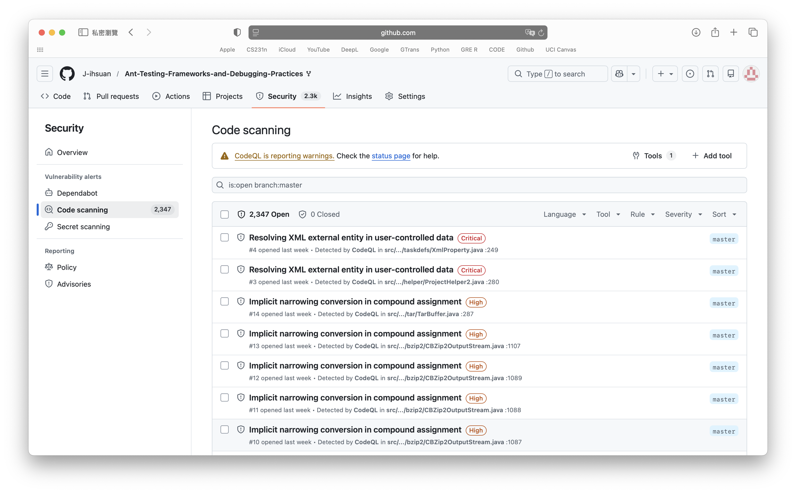
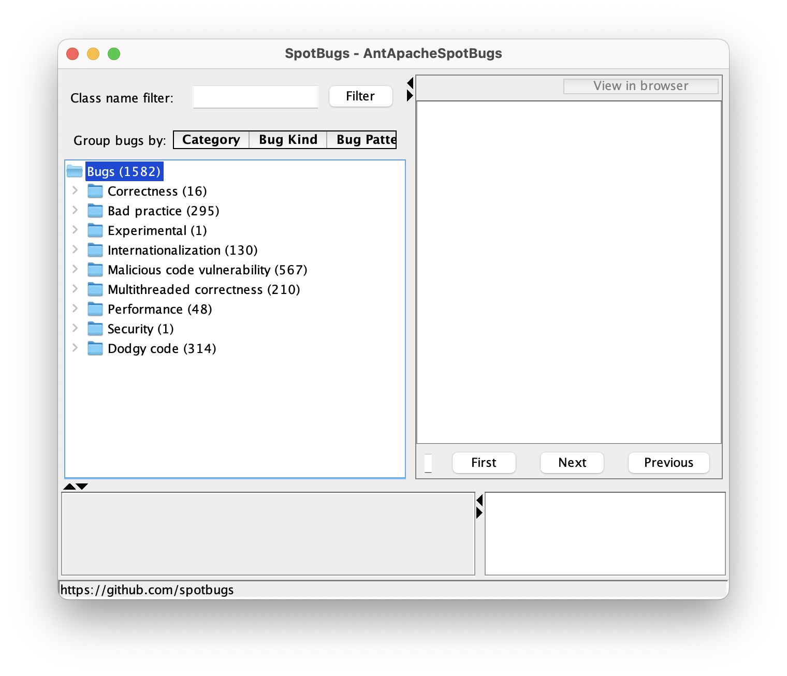
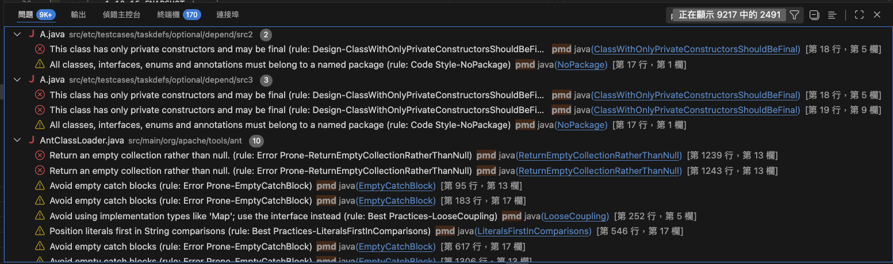
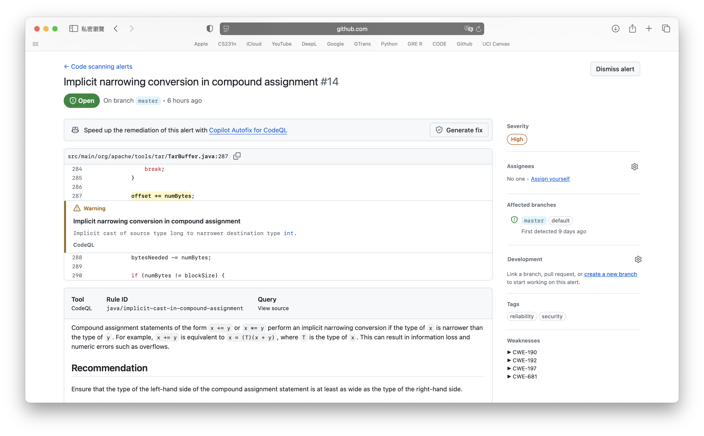
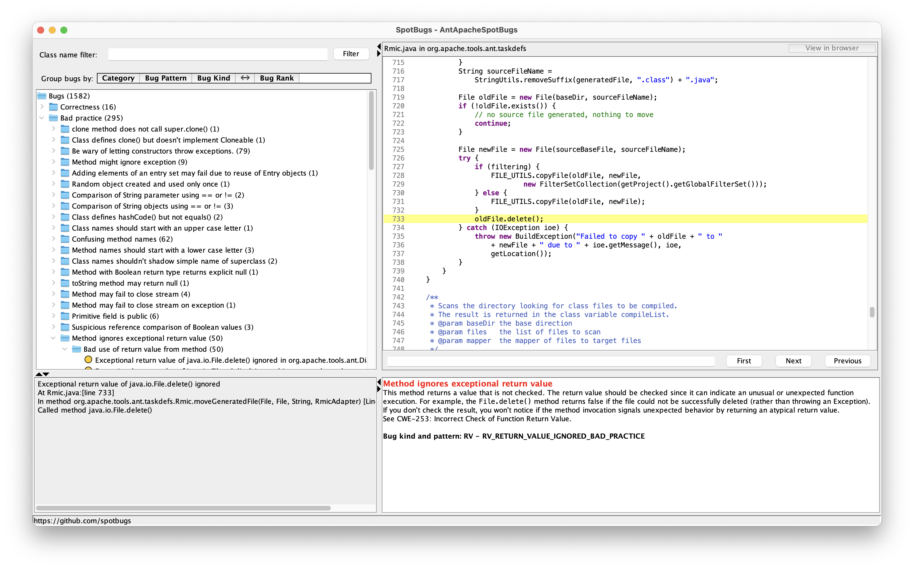
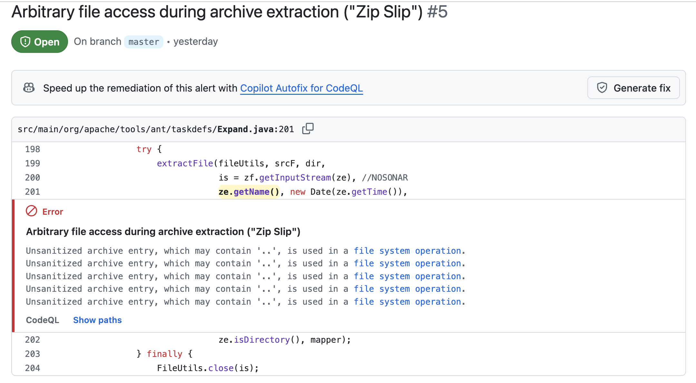
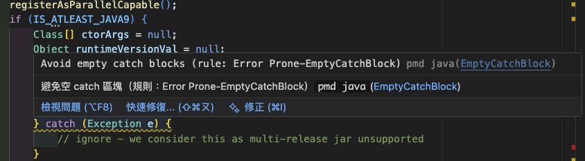
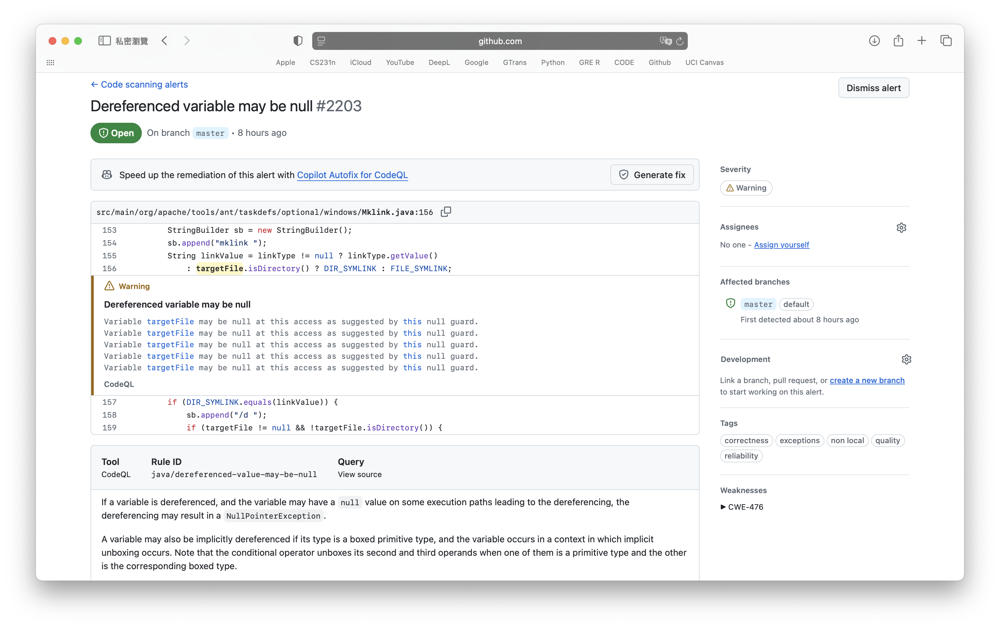
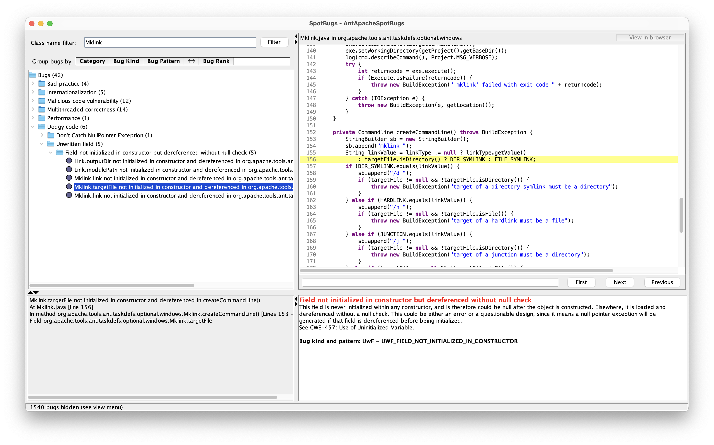

## Project Info
- Team G17
- Github: [Apache-Ant-Testing-Frameworks-and-Debugging-Practices](https://github.com/J-ihsuan/Ant-Testing-Frameworks-and-Debugging-Practices)
- Member
    - Eleanor Chiang (Github ID: J-ihsuan)
    - Chien-Tzu Yeh (Github ID: Carolyehhh)


## **1. Static Analysis Tools**
Static analysis tools are designed to examine source code or compiled bytecode without actually executing the program.

* **Goals:**  
Identify potential vulnerabilities, logic bugs as early as possible in the software development lifecycle.

* **Purposes:**   
Automate the code review process and enforce consistent coding standards across a project. They serve as a first line of defense to detect architectural flaws, silent logic errors, memory leaks, and severe security vulnerabilities.

* **Use:**  
Static analyzers are typically utilized in two main ways. 
* **Integrated directly into a developer's IDE** to provide real-time feedback and highlight bad practices during the coding phase.

* **Embedded into CI/CD pipelines** to automatically scan every new commit or pull request, ensuring that no defective code is merged into the main production branch.

## **2. Overview & Number of Findings**
* **CodeQL: 2,346 findings**


* **SpotBugs: 1,582 findings**


* **PMD: 2,491 findings**


    

## **3. Deep Dive into Selected Findings**
### **3.1 Warning: Implicit narrowing conversion in compound assignment #14 (Author: Eleanor)**
* **Tool:** GitHub CodeQL

* **Severity:** High

* **Location:** [TarBuffer.java:287](https://github.com/J-ihsuan/Ant-Testing-Frameworks-and-Debugging-Practices/blob/d634d744732acabeafb680041e5f3a760a7e164c/src/main/org/apache/tools/tar/TarBuffer.java#L287)

    ```java
    offset += numBytes;
    ```

* **Description of the Warning**

    CodeQL detected an implicit narrowing conversion caused by a compound assignment operator (like `+=` or `*=`). In Java, if the left-hand operand has a narrower data type (e.g., `short`) than the right-hand operand (e.g., `int`), a compound assignment like `x += y` does not act exactly like `x = x + y` (`int`). Instead, Java automatically inserts a hidden cast: `x = (type_of_x)(x + y)` (`short`). This means the compiler silently forces a larger type into a smaller type without throwing a compilation error, which can result in information loss and numeric errors such as overflows.

* **Is this an actual problem?**

    Yes, I believe this is a real problem. Even though the program won't crash immediately if the numbers are small, it can cause a **silent overflow**. If the result of x + y becomes larger than what a short can hold, Java will just truncate the data without throwing any errors or exceptions. This means the program will just keep running with the wrong numbers, which makes it very hard to debug later.

* **Recommendation**

    Ensure that the type of the left-hand side of the compound assignment statement is at least as wide as the type of the right-hand side.

    


### **3.2 Bad Practice: Method ignores exceptional return value (Author: Eleanor)**
* **Tool:** SpotBugs

* **Bug Rank**: 16 (Yellow)

* **Location:** [Rmic.java:733](https://github.com/J-ihsuan/Ant-Testing-Frameworks-and-Debugging-Practices/blob/d634d744732acabeafb680041e5f3a760a7e164c/src/main/org/apache/tools/ant/taskdefs/Rmic.java#L733)

    ```java
    oldFile.delete();
    ```

* **Description of the Warning**

    SpotBugs identified that the return value of `java.io.File.delete()` is being ignored. Unlike many Java I/O methods that throw an `IOException` upon failure, `File.delete()` returns a `boolean` indicating success or failure. Without not checking this return value, the program fails to handle situations when the file cannot be deleted.

* **Is this an actual problem?**
Yes, I think this is a problem. In the code, the developer is trying to simulate a **move operation** by copying the file first and then deleting the original. However, if `oldFile.delete()` fails, it just becomes a **copy operation**. Moreover, it fails silently. This will leave old files in the build directory. While it might not break the current build, these leftover files could mess up future build steps or waste disk space. 

* **Recommendation**
Wrap the delete() call in an if statement and print a warning log.

    


### **3.3 Warning: Arbitrary file access during archive extraction ("Zip Slip") #5 (Author: Chien-Tzu Yeh)**
* **Tool:** GitHub CodeQL

* **Severity:** High

* **Location:** [Expand.java](https://github.com/J-ihsuan/Ant-Testing-Frameworks-and-Debugging-Practices/blob/2b90c0da0971758576b14254164c8f45db6f9da5/src/main/org/apache/tools/ant/taskdefs/Expand.java#L199-L202)

    ```java
    extractFile(fileUtils, srcF, dir,
            is = zf.getInputStream(ze), //NOSONAR
            ze.getName(), new Date(ze.getTime()),
            ze.isDirectory(), mapper);
    ```
* **Description of the Warning**

    CodeQL flagged a critical security vulnerability known as "Zip Slip." This occurs when an application extracts an archive (like a `.zip` or `.tar` file) without properly sanitizing the file paths inside the archive. In the code above, `ze.getName()` retrieves the name of the ZipEntry directly from the archive and passes it to `extractFile`. An attacker can create a malicious archive containing file paths with directory traversal sequences (e.g., `../../../../etc/passwd`). If the application uses this unsanitized path, it will extract the file outside of the intended target directory (`dir`).

* **Is this an actual problem?**

    Yes, I think this is a dangerous problem. If this Ant task is ever used to extract an archive provided by an untrusted source, an attacker could overwrite critical system files, modify executable code, or corrupt configurations. Because the program blindly trusts the file paths encoded within the zip file, it acts as a vector for arbitrary file overwrite, which often leads to Remote Code Execution (RCE). It is not a false positive.

* **Recommendation**

    Before extracting the file, the code should be validated that the target file path remains strictly within the intended destination directory. This is typically done by resolving the **canonical path** of the target file and verifying that it starts with the canonical path of the destination folder. The program should throw a `SecurityException` if it doesn't.

    


### **3.4 Warning: Avoid empty catch blocks ("EmptyCatchBlock") (Author: Chien-Tzu Yeh)**

  * **Tool:** PMD

  * **Bug Pattern**: Error Prone - EmptyCatchBlock

  * **Location:** [AntClassLoader.java:91-97](https://github.com/J-ihsuan/Ant-Testing-Frameworks-and-Debugging-Practices/blob/f0edbf5f94367633149821d9a9afc5f1b16787fa/src/main/org/apache/tools/ant/AntClassLoader.java#L91-L97)

  * **Code Snippet:**
    ```java
    try {
                final Class<?> runtimeVersionClass = Class.forName("java.lang.Runtime$Version");
                ctorArgs = new Class[] {File.class, boolean.class, int.class, runtimeVersionClass};
                runtimeVersionVal = Runtime.class.getDeclaredMethod("version").invoke(null);
            } catch (Exception e) {
                // ignore - we consider this as multi-release jar unsupported
            }
    ```

  * **Description of the Warning**

    PMD flagged an "Error Prone" warning known as `EmptyCatchBlock`. This occurs when an application uses a `try-catch` block to handle a potential exception, but leaves the `catch` block entirely empty. In the code snippet above, the developer attempts to load Java 9+ specific classes via reflection. If this fails (e.g., because it's running on an older Java version), an `Exception` is thrown and caught, but no programmatic action is taken inside the catch block.
  

  * **Is this an actual problem?**

    In this specific instance within the Ant code, it is more of a **Code Smell** rather than a critical bug. The developer intentionally swallowed the exception because failing to find Java 9 classes simply means they should fall back to standard behavior. However, from a broader software engineering perspective, this anti-pattern is an actual problem for maintainability. When an exception is "swallowed" without logging (a "silent failure"), it hides potential issues from developers. While the comment `// ignore...` explains the intent, relying on an empty block is dangerous. If a completely unrelated exception occurs (e.g., an unexpected `SecurityException` during reflection), it will be silently buried, making future debugging incredibly difficult.
    
  * **Recommendation**

    At a minimum, the code inside the catch block should log a debug-level message. This ensures that developers have a trail to follow if something unexpected fails. Alternatively, catching a broad `Exception` should be avoided; the code should specifically catch `ClassNotFoundException` or `NoSuchMethodException` so that only the expected errors are ignored, while other critical exceptions are allowed to propagate or be properly logged.

    
    


## **4. Comparative Analysis: CodeQL vs. SpotBugs**

### **Overview & Fundamental Purposes**   
CodeQL and SpotBugs are fundamentally different in their purposes and how they analyze the codebase.

* CodeQL performs semantic analysis on the **raw source code** by querying it like a database, focusing on **data flow** and **architectural vulnerabilities**.

* SpotBugs analyzes compiled Java `.class` files using predefined bug patterns, focusing on **Java-specific language quirks, API misuses**, and **localized bad practices**.


### **Distinct Warnings vs. Overlapping Information**

Because of their different approaches, the warnings our team selected (3.2 `RV_RETURN_VALUE_IGNORED` by SpotBugs and 3.1 `Implicit narrowing conversion` by CodeQL) were entirely distinct and uniquely identified by their respective tools. SpotBugs caught a runtime logic flaw related to file I/O operations, while CodeQL caught a hidden compiler-level type casting issue. 

However, they do provide information that overlaps in nature, like Null Pointer Dereference. Interestingly, even when they identify the same risk, their descriptions reveal their fundamentally different purposes:

SpotBugs identifies this via the pattern `UWF_FIELD_NOT_INITIALIZED_IN_CONSTRUCTOR`. It approaches the problem from an object lifecycle perspective, warning that a field was never initialized in the constructor and is later dereferenced without a null check.

CodeQL identifies this simply as Dereferenced variable may be null. It approaches the problem via control-flow analysis, warning that the variable may hold a null value on "some execution paths" leading to the dereferencing.

When they identify these similar warnings, the information provided is not always of equal value. SpotBugs provides a localized warning based on class structure. In contrast, CodeQL provides a highly valuable, step-by-step data flow visualization, tracing the exact execution path of the null value, making it easier to debug complex architectural flaws.

<table>
<tr>
    <td></td>
    <td></td>
</tr>
</table>

### **Strengths and Weaknesses**
**CodeQL**
* Strengths: 
    * Cross-file data flow tracking 
    * Uncovers deep semantic and security vulnerabilities
    * Explains the "how" and "why" of a bug well
    * Clear severity categorization 

* Weaknesses: 
    * Slower analysis time because it requires building a database first
    * Overcomplicate simple issues sometimes

**SpotBugs**
* Strengths:
    * Fast execution
    * Precise at catching Java-specific bad practices, threading issues, and API misuses

* Weaknesses: 
    * Only analyzes compiled bytecode, project must build successfully before it can be scanned
    * Lack of the deep, cross-file context that CodeQL provides
    * Clunky categorization, forces developers to manually click and expand deeply nested tree structures one by one.