<details>
  <summary><H1> Part 1. Introduction. Set Up. Functional Testing and Partitioning. </H1></summary>

  ## 1. Introduction
  ### 1.1 Project Overview & Purpose
  Apache Ant is a Java-based build tool supplied by the Apache Software Foundation. Its primary purpose is to automate the software build process, replacing platform-specific tools like make with a platform-independent solution driven by XML configuration files. Established in 2000, Ant represents a highly mature and stable system that laid the groundwork for modern build tools like Maven and Gradle.
  ### 1.2 System Architecture & Design
  To effectively test the system, we analyzed its architectural design. Ant follows a modular architecture composed of a lightweight core engine and a set of independent "Tasks" (e.g., `<javac>`, `<copy>`, `<delete>`). This decoupling allows for targeted unit testing of individual tasks without loading the entire system. The project follows a standard directory layout, with core logic residing in src/main and a comprehensive test suite in src/tests, utilizing JUnit 4 as its primary testing framework. Key dependencies include XML parsers (e.g., Xerces), reflecting its configuration-driven nature.
  ### 1.3 Codebase Statistics
  To understand the scale and complexity of the Apache Ant project, we analyzed the codebase using the cloc (Count Lines of Code) tool.

  * **Primary Language:**
  The project is predominantly written in Java, consisting of approximately 147,000 lines of code across 1,330 files. This confirms that the core logic and functional implementation reside in the Java source files.

  * **Configuration Language:**
  There is a significant presence of XML (approx. 35,700 lines), which aligns with Ant's architecture of using XML-based build configuration files.

  * **Size and Composition (LOC):**
  The project codebase consists of approximately 249,000 lines of code (LOC) in total. However, to accurately assess the logical size of the system, it is important to distinguish between core implementation and supporting files:
      * **Core Logic (Java):** The functional core of the system is written in Java, comprising approximately 147,000 LOC (59% of the total). This represents the actual complexity of the build tool.

      * **Configuration & Data (XML):** XML files make up about 35,700 LOC. Since Ant is configuration-driven, these are significant but largely represent build scripts and test data rather than application logic.

      * **Documentation (HTML):** A substantial portion (~47,000 LOC) consists of HTML documentation, which is excluded from the functional complexity analysis.

      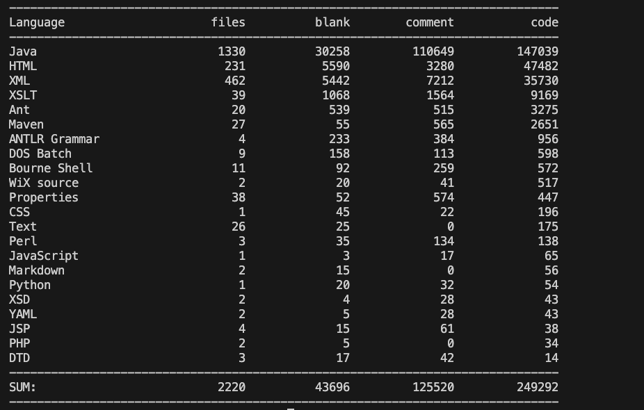
      **Figure 1**: Codebase statistics generated by `cloc`.  
  *(Note: To ensure the accuracy of our analysis, we excluded build artifacts (`build/`), version control metadata (`.git/`), and IDE configuration files (`.idea/`) from the count. This filtration ensures that the statistics reflect only the actual source code maintained by developers.)*

  ## 2. Build Process
  ### 2.1 System Environment: 
  We built the project on a macOS environment with the following specifications:
  * **Operating System**: macOS Ventura 13.0

  * **Java Version**: OpenJDK 25 LTS (Temurin-25.0.2+10-LTS)

  * **Source Code**: Cloned from the team repository. We adopted a feature branch workflow, conducting development on dedicated branches (c_branch and e_branch) to isolate changes before integration into the main branch.

  ### 2.2 Build Strategy:
  Bootstrapping Apache Ant is unique because it is a build tool used to build itself. This process is known as bootstrapping. The build script (build.sh) is designed to:
  1. Compile a minimal version of Ant.

  2. Use that minimal version to compile the full core and tasks.

  3. Use the full version to compile optional tasks and libraries.

  ### 2.3 Challenges and Resolution (What we needed to do):
  We encountered a critical issue during the initial build attempt using `./build.sh.` The build failed with the error: "We cannot build the test jar unless JUnit is present".

  This occurred because the source repository does not include external library dependencies (like JUnit) by default, and the bootstrapping process failed before creating the standard ant executable script.

  To resolve this, we performed a manual dependency fetch using the partially compiled artifacts:

  1. Identify the Artifact: We located the compiled `ant-launcher.jar` in `build/lib/`, which was successfully created during the initial failed bootstrap.

  2. Manual Invocation: Instead of relying on the broken wrapper script, we directly invoked the Java launcher to execute the fetch script:
  ```
  java -cp build/lib/ant-launcher.jar org.apache.tools.ant.launch.Launcher -f fetch.xml -Ddest=optional
  ```
  This command successfully downloaded JUnit and other required libraries into ```lib/optional```.

  ### 2.4 Final Execution:
  After resolving the dependencies, we ran the standard build command again: ```./build.sh dist```

  **Result:** The process completed with "BUILD SUCCESSFUL". The fully compiled distribution was generated in the dist/ directory, ready for use.

  ## 3. Testing Practices and Frameworks
  The testing architecture is divided into two primary categories: **JUnit** and **AntUnit**

  ### 3.1 JUnit (Java-based Testing)

  #### Purpose: 
  JUnit is used for testing of the internal **Java source code** of Ant

  #### Mechanism: 
  It operates as a traditional unit testing framework to verify that the internal Java API, string manipulation, input/output logic, and core algorithms function correctly

  #### Features:
  * Tests are written in ` .java ` files, typically located in `src/tests/junit`
  * Verifies the **internals** of the system
  * e.g., `DeleteTest.java`
      
  ### 3.2 AntUnit (XML-based Testing)

  #### Purpose:
  AntUnit is an extension library used for **functional or integration testing of Ant Tasks and Build Files**

  #### Mechanism:
  It allows developers to write test cases using **Ant's XML syntax**

  #### Features:
  * Tests are written in ` .xml ` files, typically located in `src/tests/antunit`
  * Verifies the side effects of tasks (e.g., File creation, Directory deletion)
  * e.g., `copy-test.xml`


  ## 4. Execution and Commands
  Tests are executed using the project's bootstrapping script, the script invokes specific **targets** defined in `build.xml`.

  * ```build.sh``` on Unix/Mac  
  * ```build.bat``` on Windows

  ### 4.1 Common Test Targets

  |Command	|Target	|Description|
  | - | -  | -  |
  |`./build.sh test`|	test	|**Full Suite & Reports** - It compiles the source, executes both JUnit and AntUnit tests, and generates HTML reports. If any test fails, the build terminates with BUILD FAILED.|
  |`./build.sh run-tests`|	run-tests	|**Without Reports** - Runs the full test suite but skips HTML report generation. |
  |`./build.sh junit-tests`|	junit-tests	|**Java Only** - Scans `src/tests/junit` and executes all `*Test.java` files.|
  |`./build.sh antunit-tests`|	antunit-tests	|**XML Only** - Scans `src/etc/testcases` and executes `test.xml` or `*-test.xml` scripts.|

  ### 4.2 Running Single Test Case

  To avoid running the entire suite, a specific JUnit test class can be targeted using the `-Dtestcase` property:

  ```
  ./build.sh -Dtestcase=org.apache.tools.ant.taskdefs.DeleteTest test
  ```

  ### 4.3 Test Reporting
  Ant aggregates the results into visual HTML dashboards. These reports provide pass/fail rates, execution times, and detailed stack traces for debugging.

  * JUnit Reports: Located at `build/testcases/reports/index.html`
  * AntUnit Reports: Located at `build/antunit/reports/index.html`

  <div align="center">
    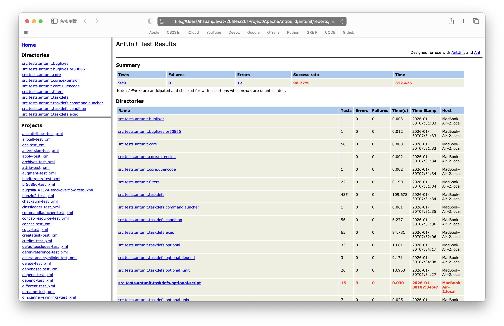
  </div>

  ## 5. Systematic Functional Testing & Partition Testing

  > **Systematic functional testing** is essential for validating software reliability because testing every possible input is practically impossible for complex systems. Without a systematic approach, testing becomes ad-hoc, leading to redundant test cases and missed edge cases.

  > **Partition Testing** addresses this by dividing the input domain of a program into finite classes of data. The underlying assumption is that the program behaves equivalently for all inputs within a single partition. This method allows us to select a small, representative subset of inputs to achieve high functional coverage with efficiency.

  ### 5.1 Feature 1: Apache Ant \<delete\> Task (Author: Eleanor)

  This feature focus on the input `file` (for single files) and `dir` (for directories). The goal is to verify that the task correctly handles different file system states.

  #### 5.1.1 Partitioning Scheme
  | Partition | Description | Boundary | Representative Input Value | Rationale for Selection |
  | :--- | :--- | :--- | :--- | :--- |
  | **Existing File** | A standard scenario where the input path points to a file that exists and can be deleted. | `.exists() == true` | `testDelete.txt` | Choose a simple text file name. In the test setup, this file is explicitly created before execution to ensure the basic deletion logic is verified. |
  | **Missing File** | An error handling scenario where the input path points to a location that contains no file. | `.exists() == false` | `testDelete.txt` (missing) | Reuse the previous filename but explicitly ensured it was deleted before the test ran. This tests the task's robustness when handling invalid paths or checking if it fails. |
  | **Empty Directory** | The input path points to an existing directory that contains no child. | `IsDirectory() == true` AND `ChildrenCount == 0` | `empty_dir/` | Choose a newly created directory with no content. This serves as a **boundary value test** (size = 0), verifying that the task correctly handles directory removal logic without needing recursion. |
  | **Non-empty Directory** | The input path points to an existing directory that contains at least one file or subdirectory. | `IsDirectory() == true` AND `ChildrenCount >= 1` | `nonempty_dir/`, containing `child.txt` | Choose a newly created directory containing one child file. This represents a complex case requiring recursion. It verifies that the task deletes the child elements first before removing the parent directory. |

  #### 5.1.2 Test Case Implementation

  The test cases were implemented using **JUnit 4** and integrated directly into the Apache Ant source tree. 
  The test instantiates the `Delete` task class directly (via the Java API) rather than parsing an XML build file. 

  * **Setup**:
    * A helper method `createProject()` was implemented to instantiate a fresh `Project` object for each test, ensuring test isolation and correct base directory resolution.
  * **`testExistFile()`**: Validates Partition 1 - Existing File
    * The test creates p1 `testDelete.txt`, configures the task with this file, executes it, and asserts that `p1.exists()` returns `false`.
  * **`testMissFile()`**: Validates Partition 2 - Missing File
    * The test ensures `testDelete.txt` does not exist, then attempts to execute the task. A `try-catch` block is used to handle potential `BuildException`s, verifying that the task handles missing files according to the configuration.
  * **`testEmptyDir()`**: Validates Partition 3 - Empty Directory
    * The test creates a directory `empty_dir`, sets the task's `dir` attribute, executes it, and asserts the directory is removed.
  * **`testNonEmptyDir()`**: Validates Partition 4 - Non-empty Directory
    * The test creates `nonempty_dir` containing `child.txt`. It executes the task and asserts that both the child file and the parent directory are successfully deleted, confirming recursive deletion logic.

  #### 5.1.3 Execution & Results
  The tests are executed using the project's native build script `build.sh`.

  ```
  ./build.sh -Dtestcase=org.apache.tools.ant.taskdefs.DeletePartitionTest test
  ```

  **Result**
  ```
  Testsuite: org.apache.tools.ant.taskdefs.DeletePartitionTest
  Tests run: 4, Failures: 0, Errors: 0, Skipped: 0, Time elapsed: 0.07 sec
  BUILD SUCCESSFUL
  ```
  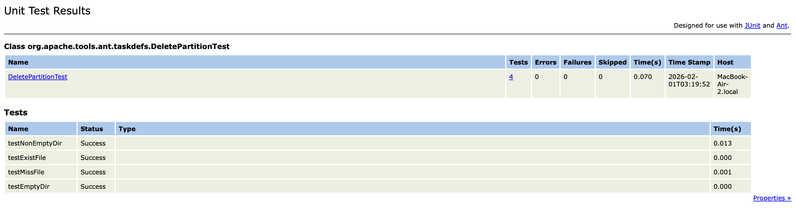

  ### 5.2 Feature 2: Apache Ant \<copy\> Task (Author: Chien-Tzu Yeh)
  This feature focuses on the input file (for single files) and todir (for destination). The goal is to verify that the task correctly handles file duplication, error states, and directory structures.

  #### 5.2.1 Partitioning Scheme
  | Partition | Description | Boundary | Representative Input Value | Rationale for Selection |
  | :--- | :--- | :--- | :--- | :--- |
  **Existing Source File** | A standard scenario where the input path points to a file that exists and is readable. | ```.exists() == true``` | ```source.txt``` | Choose a simple text file name. In the setUp target, this file is explicitly created with content "Hello Ant Testing" to ensure the basic copy logic is verified.
  **Missing Source File** | An error handling scenario where the input path points to a location that contains no file. | ```.exists() == false``` | ```ghost.txt``` | Choose a filename that is guaranteed not to exist. This tests the task's robustness and ensures it correctly throws a BuildException when the source is missing (fail-fast behavior).
  **Directory Source** | The input path points to an existing directory rather than a single file. | ```.isDirectory() == true``` | ```src_dir/``` | Choose a directory input instead of a file. This serves as a functional boundary test, verifying that the task correctly handles FileSet logic and directory structure replication differently from simple file copying.

  #### 5.2.2 Test Case Implementation

  The test cases were implemented using JUnit 4 and the BuildFileRule utility. Unlike the direct Java API approach, this test suite parses and executes targets defined in an XML build file (copy_test.xml) to simulate real-world Ant execution contexts.

  **Rationale for Implementation Strategy**

  We deliberately chose this integration testing approach for the \<copy> task to contrast with the unit testing approach used for \<delete>, based on the following technical reasons:
  * **Simulation of Real-world Usage:** Since Apache Ant is primarily driven by XML build scripts, testing via copy_test.xml allows us to verify the feature exactly as a user would execute it. This ensures that not only the underlying Java logic is correct, but also that XML attribute parsing and target execution flows are functioning as expected.
  * **Complex Configuration Handling:** The \<copy> task often involves complex nested elements like fileset and mapper. Defining these in an XML structure is more readable and less error-prone than manually constructing complex object graphs in Java.

  **Test Execution Flow**

  * **Setup:**
    * The setUp target in XML is used to clean and recreate the copy-temp directory before each test. It generates a fresh source.txt and src_dir to ensure test isolation.
  * **```testValidCopy()```**: Validates Partition 1 - Existing Source File
    * The test executes the testValidCopy target which copies source.txt to dest.txt. The Java test then asserts that dest.txt exists using assertTrue().
  * **```testMissingSource()```**: Validates Partition 2 - Missing Source File
    * The test executes the testMissingSource target which attempts to copy a non-existent ghost.txt. A try-catch block is used to expect a BuildException. If no exception is thrown, the test fails explicitly using fail().
  * **```testDirectoryCopy()```**: Validates Partition 3 - Directory Source
    * The test executes the testDirectoryCopy target which uses a \<fileset> to copy src_dir. The Java test asserts that the destination directory dest_dir is successfully created.

  #### 5.2.3 Execution & Results
  The tests are executed using the project's native build script.

  ```
  ./build.sh test -Dtestcase=org.apache.tools.ant.taskdefs.CarolCopyTest
  ```


  **Result**
  ```
  Tests run: 3, Failures: 0, Errors: 0, Skipped: 0, Time elapsed: 0.348 sec

  Testcase: testDirectoryCopy took 0.198 sec
  Testcase: testValidCopy took 0.053 sec
  Testcase: testMissingSource took 0.034 sec
  ```
  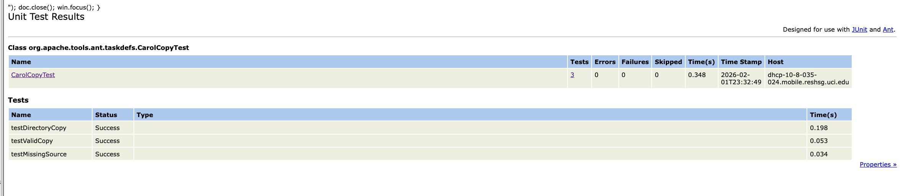

</details>

<details>
  <summary><H1> Part 2. Functional Testing and Finite State Machines. </H1></summary>

  ## 1. Finite Model-Based Testing
  ### The Utility of Finite Models in Testing
  Finite models, such as **Finite State Machines (FSMs)**, provide a mathematical abstraction that transforms complex systems into manageable states and transitions. This shifts the testing focus from simple inputs to **behavioral logic**, allowing testers to design cases systematically.  

  Advantages of FSMs:

  **Systematic Coverage & Logic Validation**
  - **Transition Coverage:** Replaces ad-hoc testing with a framework that ensures every logical path—from the "happy path" to various failure scenarios—is exercised.
  - **Sequential Logic:** Ensures tasks follow a strict execution order, such as requiring successful validation before starting data-destructive I/O.
  - **Logical Flaws:** Detects structural issues like unreachable states or dead states by guaranteeing every state and transition is covered.

  **Model Checking & Safety Verification**
  - **Safety Guarantees:** Verifies the system never enters illegal states, does not deadlock, and eventually terminates.
  - **Error Transition Mapping:** Explicitly defines how the system reaches a FAILED state, verifying that it halts safely via exception handling rather than continuing in an unstable state.

  **Complexity Management & Test Oracle**
  - **Acting as a Test Oracle:** Provides the expected behavior for any input sequence. Any deviation indicates a fault in either the code or the model.
  - **Complexity Management:** Abstracts intricate code into states and transitions, making it easier to identify edge cases and hidden dependencies.

  ## 2.1 Feature 1: Apache Ant \<copy\> Task (Author: Chien-Tzu Yeh)
  ### 2.1.1 Selection of a Non-trivial Functional Component

  I have selected the \<copy\> task as the functional component for modeling. This feature is ideal for a Finite State Machine (FSM) because it is non-trivial; it operates as a sequence of dependent stages rather than a simple, single-step command.

  **Why it lends itself to FSM Modeling:**

  Analysis of [**Copy.java**](https://github.com/J-ihsuan/Ant-Testing-Frameworks-and-Debugging-Practices/blob/master/src/main/org/apache/tools/ant/taskdefs/Copy.java) identifies a state-dependent lifecycle with the following key characteristics:

  - **Strict State Sequencing:** The task must pass through a Validation phase before any file operations occur. If the attributes (like file or todir) are invalid, the task terminates immediately via a BuildException or a strategic return, ensuring that the system never enters an unstable Execution state with invalid parameters.

  - **Conditional Logic & Error Handling:** The task manages different error states based on user configuration (e.g., the failonerror attribute). It can either transition to a Failed state (throwing an exception) or an Aborted/Finished state (logging a warning and returning), demonstrating sophisticated decision-making during the lifecycle.

  - **Resource Dependency:** The transition to the final Copying state is predicated on the successful resolution of resource collections and directory creation.

  By modeling this as an FSM, we can systematically verify these transition boundaries and ensure the operational sequence is never violated.

  ### 2.1.2 Functional Model Design (FSM)
  To systematically verify the behavioral logic of the <copy\> task, I modeled its execution lifecycle as a Finite State Machine (FSM). This approach allows me to test the task's transitions between different operational phases and ensure it handles errors according to the defined sequential dependencies.

  **a. State Machine Diagram**

  <div align="center">
    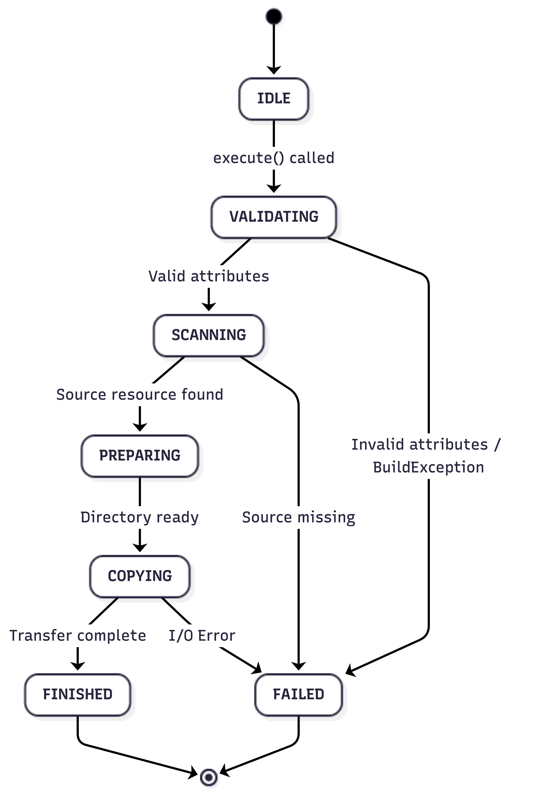
  </div>


  **b. Detailed State Descriptions**

  | State | Description |
  | :--- | :--- |
  | **IDLE** | The initial state where the Copy object is instantiated. It waits for property setters (e.g., setFile()) to be called by the Ant engine. |
  | **VALIDATING** | The task checks if the minimum required attributes are present. If file and todir (or tofile) are missing, it triggers an early exit. |
  | **SCANNING** | The system searches the filesystem for the source resources. It ensures that the specified FileSet or individual file actually exists before proceeding. |
  | **PREPARING** | Once resources are confirmed, the task ensures the destination directory tree exists, calling mkdirs() if necessary to prepare for the write operation. |
  | **COPYING** | The core execution phase where byte streams are opened, and data is transferred from source to destination. |
  | **FINISHED** | A terminal state indicating all files were successfully copied and all system resources (streams) were closed properly. |
  | **FAILED** | A terminal state reached when a BuildException is thrown. This prevents further execution to maintain filesystem integrity. |

  **c. Transition Logic (Sequence)**

  The FSM follows a strict sequential dependency:

  - **Control Flow:** The transition from VALIDATING to SCANNING is the first guard. As observed in the source code, if validation fails, the task either logs a warning and returns or throws an exception, never reaching the copying phase.

  - **Failure Handling:** Transitions to the FAILED state are non-reversible and immediate upon detecting a BuildException (provided failonerror is true).

  - **Completion:** The FINISHED state can only be reached if the entire sequence—from attribute checking to the final byte transfer—is completed without interruption.

  ### 2.1.3 Test Implementation & Documentation
  To validate the FSM model, I implemented **Transition Coverage testing** using **JUnit 4**. These tests ensure that the <copy\> task transitions correctly between states under both valid and invalid conditions.

  **a. Test Cases and Path Coverage:**
  - [`testFullSuccessPath`](https://github.com/J-ihsuan/Ant-Testing-Frameworks-and-Debugging-Practices/blob/afb6ab9de7ba2fac5537bec9ab1670d15b9a65de/src/tests/junit/org/apache/tools/ant/taskdefs/CarolCopyFsmTest.java#L35-L46): Validates the transition `IDLE` -> `VALIDATING` -> `SCANNING` -> `PREPARING` -> `COPYING` -> `FINISHED`. It confirms that valid files are moved and the process ends successfully.

  - [`testMissingDestDir`](https://github.com/J-ihsuan/Ant-Testing-Frameworks-and-Debugging-Practices/blob/afb6ab9de7ba2fac5537bec9ab1670d15b9a65de/src/tests/junit/org/apache/tools/ant/taskdefs/CarolCopyFsmTest.java#L53-L58): Validates the transition `VALIDATING` -> `FAILED`. It confirms the task throws a `BuildException` when a mandatory attribute is missing.

  - [`testSourceFileMissing`](https://github.com/J-ihsuan/Ant-Testing-Frameworks-and-Debugging-Practices/blob/afb6ab9de7ba2fac5537bec9ab1670d15b9a65de/src/tests/junit/org/apache/tools/ant/taskdefs/CarolCopyFsmTest.java#L64-L73): Validates the transition `SCANNING` -> `FAILED`. It ensures the system correctly halts when the source resource cannot be located.

  **b. Implementation Details:**
  - Test File: [CarolCopyFsmTest.java](https://github.com/J-ihsuan/Ant-Testing-Frameworks-and-Debugging-Practices/blob/master/src/tests/junit/org/apache/tools/ant/taskdefs/CarolCopyFsmTest.java#L64-L73)
  - Execution Command:
    ```
    cd ApacheAnt
    ```
    ```
    ./build.sh -Dtestcase=org.apache.tools.ant.taskdefs.CarolCopyFsmTest test
    ```
  - Results: The FSM-based test suite for the <copy\> task was executed on macOS using JDK 25. The test specifically targeted the transition paths defined in the model.

    ```Testsuite: org.apache.tools.ant.taskdefs.CarolCopyFsmTest
    Tests run: 3, Failures: 0, Errors: 0, Skipped: 0, Time elapsed: 0.145 sec

    Testcase: testSourceFileMissing took 0.032 sec
    Testcase: testFullSuccessPath took 0.013 sec
    Testcase: testMissingDestDir took 0.001 sec
    ```

  *Note on Build Status: Although the overall build reported a failure due to environment-specific compatibility issues, the specific functional tests for CarolCopyFsmTest passed with 100% success, confirming the reliability of the modeled state transitions.*


  ## 2.2 Feature 2 - MailMessage (Author: Eleanor)
  ### 2.2.1 Selection of a Non-trivial Functional Component
  #### Source code
  * [org.apache.tools.mail.MailMessage](https://github.com/J-ihsuan/Ant-Testing-Frameworks-and-Debugging-Practices/blob/098077beda8accd6a3453f6058214c6991ad8eae/src/main/org/apache/tools/mail/MailMessage.java)

  #### Description   
  The [`MailMessage`](https://github.com/J-ihsuan/Ant-Testing-Frameworks-and-Debugging-Practices/blob/098077beda8accd6a3453f6058214c6991ad8eae/src/main/org/apache/tools/mail/MailMessage.java) class is a utility in Apache Ant used to send emails via the SMTP protocol. It manages an active network socket (`java.net.Socket`) and implements the client-side state of an SMTP transaction strictly.

  #### Why it lends itself well to a FSM
  - **Strict Sequential Constraints:**   
      The class imposes a rigid execution order dictated by the SMTP protocol. For example, a user cannot define a recipient before defining a sender, nor can they send the message before defining recipients.
  - **Distinct Stages:**   
      The object moves through clear stages: `CONNECTED` → `SENDER_SET` → `RECIPIENT_SET` → `DATA_MODE` → `SENT_CLOSE`
  - **Enforced Transition Logic:**   
      The class contains an internal validation mechanism [`isResponseOK`](https://github.com/J-ihsuan/Ant-Testing-Frameworks-and-Debugging-Practices/blob/098077beda8accd6a3453f6058214c6991ad8eae/src/main/org/apache/tools/mail/MailMessage.java#L439-L447). If a method is called out of order, the underlying SMTP server returns an error code, and the `MailMessage` class catches this and throws an `IOException`. This prevents invalid state transitions effectively.
  - **Error State Handling:**   
      If the socket connection fails, the object enters an invalid state where no further commands can be processed.
  - **Terminal States:** 
      The object has a definitive lifecycle. Once [`sendAndClose()`](https://github.com/J-ihsuan/Ant-Testing-Frameworks-and-Debugging-Practices/blob/098077beda8accd6a3453f6058214c6991ad8eae/src/main/org/apache/tools/mail/MailMessage.java#L333-L340) is called, the socket is closed, and the object reaches a terminal state that cannot be reused.

  ### 2.2.2 Functional Model Design
  **Model Description:**  
  The functional model represents the lifecycle of an SMTP transaction handled by the `MailMessage` class. The state transitions are guarded by the server's response codes; any out-of-order command results in an IOException, moving the system to an ERROR state.

  **Finite State Diagram**

  <div align="center">
    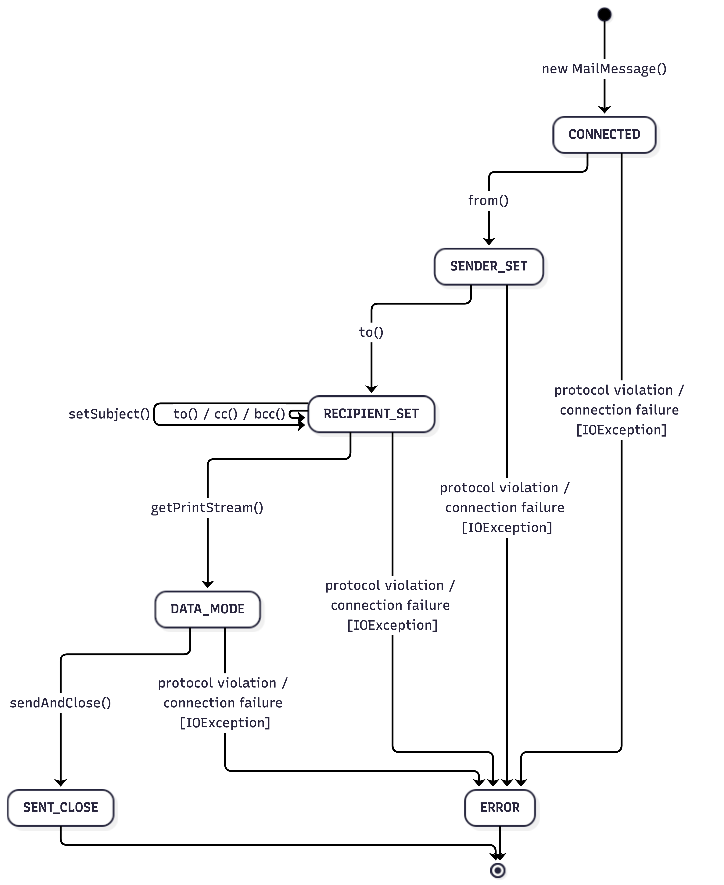
  </div>

  **States Description**
  | State | Description |
  | ----- | ----------- |
  |**CONNECTED**| Initial state after [`new MailMessage()`](https://github.com/J-ihsuan/Ant-Testing-Frameworks-and-Debugging-Practices/blob/098077beda8accd6a3453f6058214c6991ad8eae/src/main/org/apache/tools/mail/MailMessage.java#L149-L177) is constructed. <br> The socket is open, and the `HELO` command accepted by the server.|
  |**SENDER_SET**| Sender address is set via [`from()`](https://github.com/J-ihsuan/Ant-Testing-Frameworks-and-Debugging-Practices/blob/098077beda8accd6a3453f6058214c6991ad8eae/src/main/org/apache/tools/mail/MailMessage.java#L194-L197) and `MAIL FROM` command accepted.|
  |**RECIPIENT_SET**| Recipient address is set via [`to()`](https://github.com/J-ihsuan/Ant-Testing-Frameworks-and-Debugging-Practices/blob/098077beda8accd6a3453f6058214c6991ad8eae/src/main/org/apache/tools/mail/MailMessage.java#L217-L220) and `RCPT TO` command accepted. <br> Additional recipients or subject can be added here without changing the state.|
  |**DATA_MODE**| [`getPrintStream()`](https://github.com/J-ihsuan/Ant-Testing-Frameworks-and-Debugging-Practices/blob/098077beda8accd6a3453f6058214c6991ad8eae/src/main/org/apache/tools/mail/MailMessage.java#L276-L286) method is called, indicating the start of writing the email body. `DATA` command accepted.|
  |**SENT_CLOSE**|Terminal state after [`sendAndClose()`](https://github.com/J-ihsuan/Ant-Testing-Frameworks-and-Debugging-Practices/blob/098077beda8accd6a3453f6058214c6991ad8eae/src/main/org/apache/tools/mail/MailMessage.java#L333-L340) is executed. `QUIT` command accepted, and the socket is disconnected.|
  |**ERROR**|Terminal state reached when an IOException occurs due to: <br> **Protocol Violation:** Calling methods out of order (e.g., to() before from()), causing a server error. <br> **Connection Failure:** Network interruption.|

  **Transitions & Rules**
  1. **Sequential Flow:**     
      The model enforces the path: `CONNECTED` → `SENDER_SET` → `RECIPIENT_SET` → `DATA_MODE` → `SENT_CLOSE`

  2. **Self-Transitions:**    
      In the `RECIPIENT_SET` state, methods `to()`, `cc()`, `bcc()` and `setSubject()` are valid self-transitions. They perform actions sending `RCPT TO` or updating internal maps but not change the state.

  3. **Error Handling:**  
      The `MailMessage` class validates every transition by checking the SMTP server's response code (via `isResponseOK()`). If the server returns a error code, the class throw an IOException and transition to the ERROR state.

  ### 2.2.3 Test Implementation & Documentation

  To validate the Finite State Machine model of the `MailMessage` class, I implemented the JUnit test suite `MailMessageFSMTest.java`. And since the `MailMessage` class relies on actual network socket connections, I employed mock servers to verify different state transitions.

  **Test File** 
  * [MailMessageFSMTest.java](https://github.com/J-ihsuan/Ant-Testing-Frameworks-and-Debugging-Practices/blob/098077beda8accd6a3453f6058214c6991ad8eae/src/tests/junit/org/apache/tools/mail/MailMessageFSMTest.java)

  **Test Case Preview**
  ```
  @Test(expected = IOException.class)
  public void testFSMProtocolViolation() throws IOException, InterruptedException {
    OOOMailServer oooServer = new OOOMailServer();
    oooServer.start();
    try {
      MailMessage msg = new MailMessage("localhost", oooServer.getPort());
      msg.to("to@you.com");       
    } finally {
      oooServer.kill();
    }
  }
  ```

  **Test Strategy**
  1.  **Happy Path Verification:**
      Use the Ant project's built-in [`DummyMailServer`](https://github.com/J-ihsuan/Ant-Testing-Frameworks-and-Debugging-Practices/blob/098077beda8accd6a3453f6058214c6991ad8eae/src/tests/junit/org/apache/tools/ant/DummyMailServer.java) to simulate a standard SMTP server. This verifies that the client correctly executes the full sequence of state transitions under normal conditions.

  2.  **Error Path Verification:**
      Implement custom mock servers (`OOOMailServer` and `GhostMailServer`) to simulate protocol violations and network interruptions. These verify that the FSM correctly transitions to the **ERROR** state and throws an `IOException`.

  **Test Case**

  | Test Method | Scenario | Covered FSM Path | Description |
  | :--- | :--- | :--- | :--- |
  | [`testFSMHappyPath`](https://github.com/J-ihsuan/Ant-Testing-Frameworks-and-Debugging-Practices/blob/098077beda8accd6a3453f6058214c6991ad8eae/src/tests/junit/org/apache/tools/mail/MailMessageFSMTest.java#L41-L87) | **Standard Transaction**<br>Verifies the complete valid sequence of SMTP commands. | `[*] -> CONNECTED -> SENDER_SET -> RECIPIENT_SET -> DATA_MODE -> SENT_CLOSE` | The client completes the transaction without error. The log verifies the correct receipt of `HELO`, `MAIL FROM`, `RCPT TO`, `DATA`, `QUIT` and success codes 220, 250, 354 and 221. |
  | [`testFSMProtocolViolation`](https://github.com/J-ihsuan/Ant-Testing-Frameworks-and-Debugging-Practices/blob/098077beda8accd6a3453f6058214c6991ad8eae/src/tests/junit/org/apache/tools/mail/MailMessageFSMTest.java#L95-L112) | **Protocol Violation**<br>Simulates an attempt to set a recipient before a sender is established. | `CONNECTED` --(`to()` skip `from()`)--> `RECIPIENT_SET` (Invalid) -> `ERROR` | The `OOOMailServer` returns a `500 Error` when the out-of-order command is received. The `MailMessage` class detects the error code and throws an `IOException`. |
  | [`testFSMNetworkInterruption`](https://github.com/J-ihsuan/Ant-Testing-Frameworks-and-Debugging-Practices/blob/098077beda8accd6a3453f6058214c6991ad8eae/src/tests/junit/org/apache/tools/mail/MailMessageFSMTest.java#L120-L143) | **Network Interruption**<br>Simulates a server crash or connection loss during the transaction. | `CONNECTED` -> `SENDER_SET` -> `RECIPIENT_SET` -> `ERROR` | The `GhostMailServer` accepts the connection but closes the socket after the `RCPT TO` stage. The client throws an `IOException` when attempting to write data to the closed connection. |

  **Mock Servers**
  * **[`OOOMailServer`](https://github.com/J-ihsuan/Ant-Testing-Frameworks-and-Debugging-Practices/blob/098077beda8accd6a3453f6058214c6991ad8eae/src/tests/junit/org/apache/tools/mail/MailMessageFSMTest.java#L146-L198)** (Out-of-Order):  
      A mock SMTP server designed to simulate protocol errors. It will return a `500 Error` response when it receives `RCPT TO`.

  * **[`GhostMailServer`](https://github.com/J-ihsuan/Ant-Testing-Frameworks-and-Debugging-Practices/blob/098077beda8accd6a3453f6058214c6991ad8eae/src/tests/junit/org/apache/tools/mail/MailMessageFSMTest.java#L201-L255):**
      A mock SMTP server designed to simulate network failures. It closes the socket connection after receiving `RCPT TO`.

  **Test Implementation**

  The tests are executed using the project's native build script `build.sh`.
  ```
  cd ApacheAnt
  ```

  ```
  ./build.sh -Dtestcase=org.apache.tools.mail.MailMessageFSMTest test
  ```

  **Result**
  ```
  Testsuite: org.apache.tools.mail.MailMessageFSMTest
  Tests run: 3, Failures: 0, Errors: 0, Skipped: 0, Time elapsed: 0.076 sec
  BUILD SUCCESSFUL
  ```
  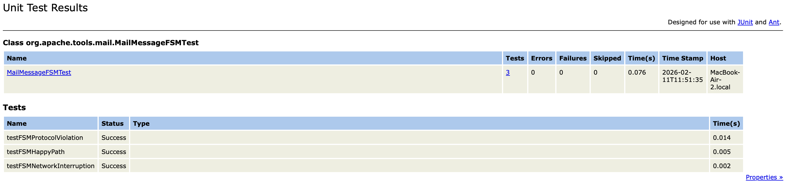

</details>

<details>
  <summary><H1> Part 3. White Box Testing and Coverage. </H1></summary>

  ## 1. Structural Testing
  Structural testing, commonly referred to **White-Box Testing**, is a software testing method to examines the internal code, structure, logic, and design.

  Unlike black-box (functional) testing, which only examines inputs and outputs, structural testing requires testers to possess the ability to read code. The goal of testing is to ensure that all paths, conditions, and statements within the program execute as intended.

  **Key mechanisms**
  * **Control Flow Testing**: Analyzing the sequence of execution instructions. 
  * **Data Flow Testing**: Tracking the lifecycle of variables.
  * **Coverage Metrics**: Ensuring specific criteria are met, like Statement Coverage (each line) or Branch Coverage (each condition).

  **Advantages**
  * **Reveals Hidden Logic Errors**: Many bugs are in edge cases or rarely executed "else" blocks. It forces testers to reach these corners, ensuring no errors occur in overlooked areas.

  * **Validates Complex Decision Logic**: It ensures that errors in conditional expressions (e.g., mistyping `>` as `>=`) are immediately detected by covering specific boundary paths.
  
  * **Eliminates Dead Code**: It helps identify unreachable or "dead" code—segments that can never be executed, allowing developers to clean the code and improve maintainability.

  * **Enhances Code Quality**: By using coverage metrics, teams have a quantitative measurement of how much of the code has actually been tested. This reduces the likelihood of bugs reaching production environments. 

  * **Detects Early Defect**: Bugs are found and fixed early in the lifecycle, which is much more cheaper or more cost-effective than fixing them after deployment.


  ## 2. Coverage of the Existing Test Suite 
  ### 2.1 Test Environment & Method  
  * Tool: **JaCoCo**.
  * Setup:
    1. Downloaded the [JaCoCo package](https://www.jacoco.org/jacoco/).
    2. Placed `jacocoagent.jar` and `jacococli.jar` into `lib/optional`.
    3. Run tests and attach the JaCoCo agent to the Ant build process:
    ```
    ./build.sh test -Dtest.junit.vmargs="-javaagent:lib/optional/jacocoagent.jar=destfile=jacoco.exec"
    ```
  * Generate Report:  
    ```
    java -jar lib/optional/jacococli.jar report jacoco.exec --classfiles build/classes --sourcefiles src/main --html jacoco_report
    ```
    ###### Report will be in `jacoco_report` folder.

  ### 2.2 Overall Coverage Summary
  The initial coverage report reveals that the existing test suite provides moderate code coverage. With **49% Line Coverage** and **44% Branch Coverage**, nearly half of the project's core logic is exercised by the current tests.
  |                  | Total   | Missed  | Covered | Coverage % | Description |
  |:----------------:|:-------:|:-------:|:-------:|:----------:|:------------|
  | **Instructions** | 250,502 | 126,501 | 124,001 | 49%        | Smallest unit of execution <br>(Java byte code instructions) |
  | **Branches**     | 26,307  | 14,482  | 11,825  | 44%        | Control flow branches <br>(if/else/switch) |
  | **Lines**        | 58,046  | 28,749  | 29,297  | 50%      | Source code lines  |
  | **Methods**      | 11,393  | 5,516   | 5,877   | 51%      | Method invocations |
  | **Classes**      | 1,146   | 433     | 713     | 62%      | Class loading      |

  <details>
    <summary>Click to View Detail Overall Report</summary>
    <div align="center">
      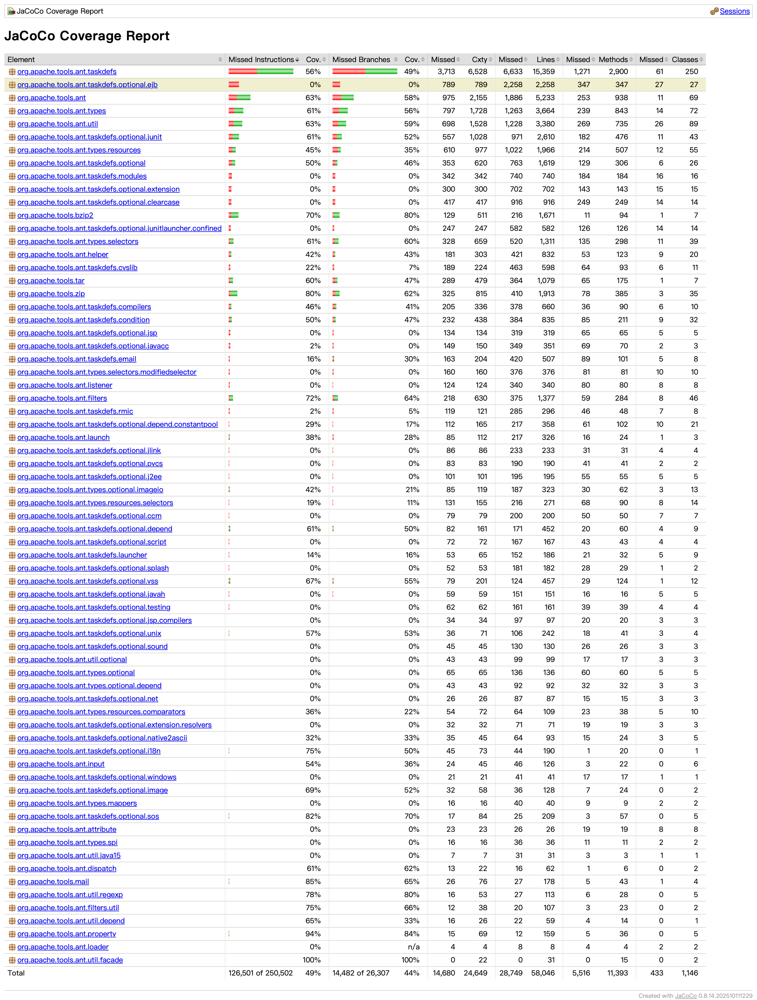
    </div>
  </details>

  ### 2.3 \<Delete\> Class Coverage Summary
  The [**Delete**](https://github.com/J-ihsuan/Ant-Testing-Frameworks-and-Debugging-Practices/blob/098077beda8accd6a3453f6058214c6991ad8eae/src/main/org/apache/tools/ant/taskdefs/Delete.java) class is currently a weak point in the test suite, falling below the project average.  
  The method coverage is the most critical metric, indicating that more than half of the methods in this class are never invoked by any test.

  |                  | Total | Missed | Covered | Coverage % | 
  |:----------------:|:-----:|:------:|:-------:|:----------:|
  | **Instructions** | 1,270 | 691 | 579 | 45%     | 
  | **Branches**     | 170   | 91  | 79  | 46%     | 
  | **Lines**        | 290   | 158 | 132 | 45%     | 
  | **Methods**      | 49    | 32  | 17  | 35%     | 

  **Uncovered Part**  
  1. The `removeFiles(File, String[], String[])` method is completely missed, the logic for deleting a list of specific files is never executed during the test.
  2.  Most adding methods for selector list, like `addSelector()`, `addAnd()`, `addOr()` and creating method for configurations, like `createInclude()`, `createIncludesFile()` are untested, resulting in low method coverage.
  3. Some logical branches are missed. For instance, methods like `delete(File)` and `handle(Exception)` have low branch coverage, some of their paths and edge cases are not adequately tested.
  <details>
    <summary>Click to View Detail Report of Delete</summary>
    <div align="center">
      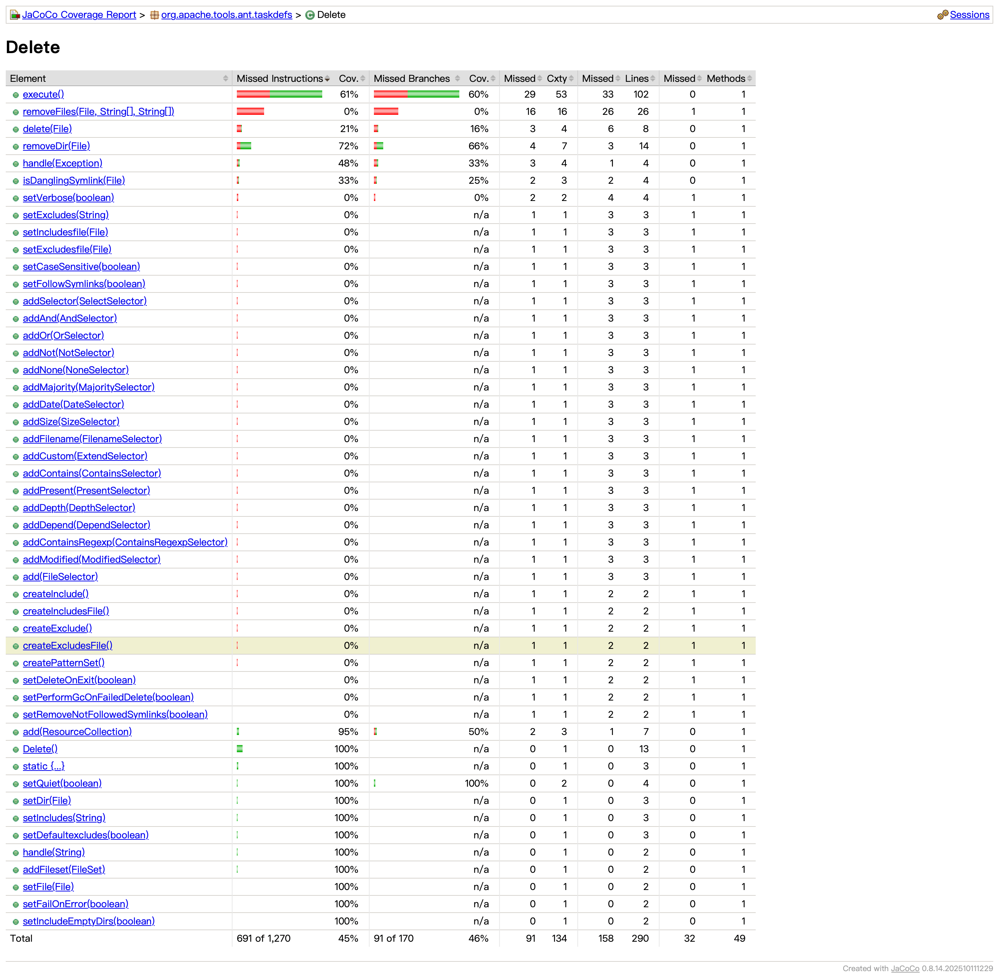
    </div>
  </details>

  ----

  ### 2.4 \<Mail\> Function Coverage Summary
  The [**Mail**](https://github.com/J-ihsuan/Ant-Testing-Frameworks-and-Debugging-Practices/tree/098077beda8accd6a3453f6058214c6991ad8eae/src/main/org/apache/tools/mail) function demonstrates strong test reliability, significantly outperforming the project average. The 85% instruction and 88% method coverage are excellent, showing that the primary functionality is well-tested.
  |                  | Total | Missed | Covered | Coverage % | 
  |:----------------:|:-----:|:------:|:-------:|:----------:|
  | **Instructions** | 697  | 99 | 598 | 85%     | 
  | **Branches**     | 66   | 23 | 43  | 65%     | 
  | **Lines**        | 178  | 27 | 151 | 84%     | 
  | **Methods**      | 43   | 5  | 38  | 88%     | 
  | **Classes**      | 4    | 1  | 3   | 75%     |

  **Uncovered Part**  
  1. The [**ErrorInQuitException**](https://github.com/J-ihsuan/Ant-Testing-Frameworks-and-Debugging-Practices/blob/098077beda8accd6a3453f6058214c6991ad8eae/src/main/org/apache/tools/mail/ErrorInQuitException.java) class is missed. The tests never trigger the error condition that occurs during the SMTP `QUIT` command.
  2. In the [**MailMessage**](https://github.com/J-ihsuan/Ant-Testing-Frameworks-and-Debugging-Practices/blob/098077beda8accd6a3453f6058214c6991ad8eae/src/main/org/apache/tools/mail/MailMessage.java) class, the alternative Constructors `MailMessage()`, `MailMessage(String)` and `setPort(int)` are never used. The tests use the `MailMessage(String, int)` constructor.
  <details>
    <summary>Click to View Detail Report of Mail</summary>
    <div align="center">
      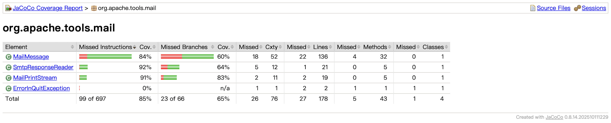
    </div>
  </details>

----

### 2.5 \<Move\> Class Coverage Summary

The `Move` class provides moderate coverage but contains several critical untested areas, particularly in error handling and directory deletion logic. With 66% Instruction Coverage, approximately 34% of the class's logic remains unexercised by the current test suite.

|                  | Total | Missed | Covered | Coverage % | Description                |
|:----------------:|:-----:|:------:|:-------:|:----------:|:---------------------------|
| **Instructions** | 905   | 303    | 602     | 66%        | Smallest unit of execution |
| **Branches** | 116   | 39     | 77      | 66%        | Control flow branches      |
| **Lines** | 162   | 48     | 114     | 66%        | Source code lines          |
| **Methods** | 11    | 1      | 10       | 90%        | Method invocations         |

- **Uncovered Code Analysis:**

  Based on the detailed `JaCoCo` report, there are still 303 instructions (34%) in the Move class that remain uncovered. The most prominent testing gaps are identified in the `deleteDir(File, boolean)` method, which has only 35% coverage, and the `setPerformGcOnFailedDelete(boolean)` method, which stands at 0% coverage. The current test suite primarily focuses on basic "happy path" migration scenarios while neglecting exceptional execution paths, such as file operation failures or specialized recovery logic involving garbage collection (GC). Bridging these gaps will be the primary objective of my subsequent test enhancements.

  <details>
    <summary>Click to View Detail Report of Move</summary>

  - *Overall Coverage*
  

  - *Detail Coverage*
  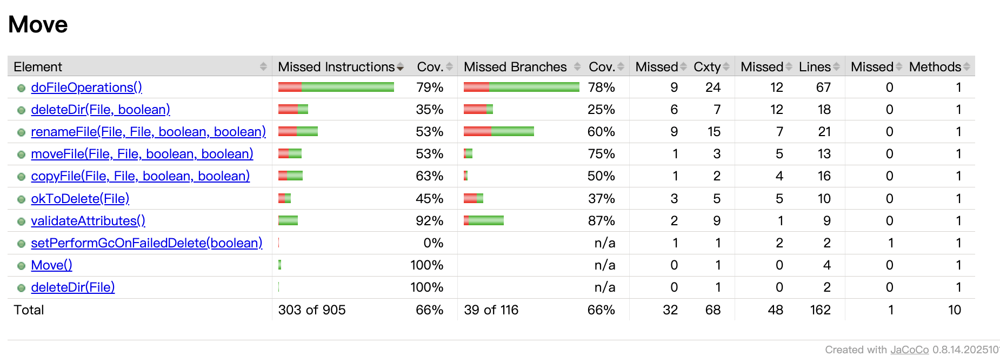

  </details>

----

### 2.6 \<Copy\> Class Coverage Summary

The `Copy` class generally maintains high coverage standards due to its centrality in Ant's operations. However, specific edge cases, private methods used for exception handling, and complex resource mapping logic remain untested.

|                  | Total | Missed | Covered | Coverage % | Description                |
|:----------------:|:-----:|:------:|:-------:|:----------:|:---------------------------|
| **Instructions** | 1,917 | 470    | 1,447   | 75%        | Smallest unit of execution |
| **Branches** | 254   | 89     | 165     | 64%        | Control flow branches      |
| **Lines** | 409   | 92     | 317     | 77%        | Source code lines          |
| **Methods** | 52    | 7      | 45      | 86%        | Method invocations         |

- **Uncovered Code Analysis**:
According to the `JaCoCo` report, while the core functionality is well-tested, there are notable gaps. Specifically, the private method `getDueTo(Exception)` shows 0% coverage, meaning exception messages related to copy failures are never verified. Additionally, the `validateAttributes()` method and `buildMap()` (used for resource mapping) have significant red blocks (Missed Lines: 92 total). These represent "hard-to-reach" logic paths involving specific attribute combinations and error states that standard XML-based tests fail to trigger.

<details>
<summary>Click to View Detail Report of Copy</summary>

- **Overall Coverage**


- **Detail Coverage**
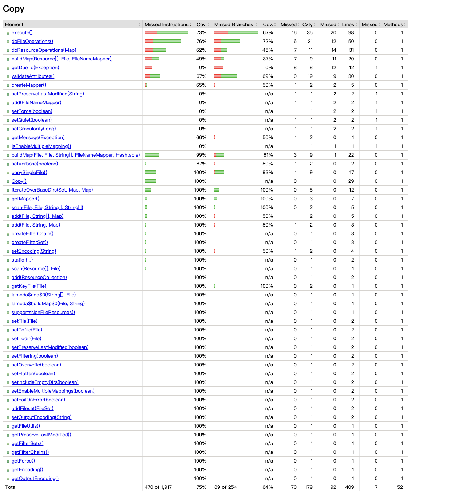

</details>

----

### 2.7 <ExecuteOn> Class Coverage Summary (Author: Chien-Tzu Yeh)
The `ExecuteOn` class represents a significant gap in the current test suite. It is completely untested, with **0% coverage** across all metrics. This class is responsible for executing system commands on a set of files, which is a critical functionality for build automation.

|                  | Total | Missed | Covered | Coverage % | Description                |
|:----------------:|:-----:|:------:|:-------:|:----------:|:---------------------------|
| **Instructions** | 1,308 | 1,308  | 0       | 0%         | Smallest unit of execution |
| **Branches** | 176   | 176    | 0       | 0%         | Control flow branches      |
| **Lines** | 282   | 282    | 0       | 0%         | Source code lines          |
| **Methods** | 33    | 33     | 0       | 0%         | Method invocations         |

- **Uncovered Code Analysis**

  The `ExecuteOn` class is entirely "red" in the initial coverage report. All 282 lines of code, including command line construction, file set iteration, and parallel execution logic, are untouched by existing tests. Specifically, complex methods such as `runExec(Execute)` and `getCommandline(String[], File[])` are completely unexercised. This represents a critical testing blind spot in Ant's taskdefs, as the logic for mapping source files to destination files through a mapper—and subsequently executing system commands—has no verification in the current suite.

<details>
<summary>Click to View Detail Reports of ExecuteOn</summary>

- **Overall Coverage**


- **Detail Coverage**
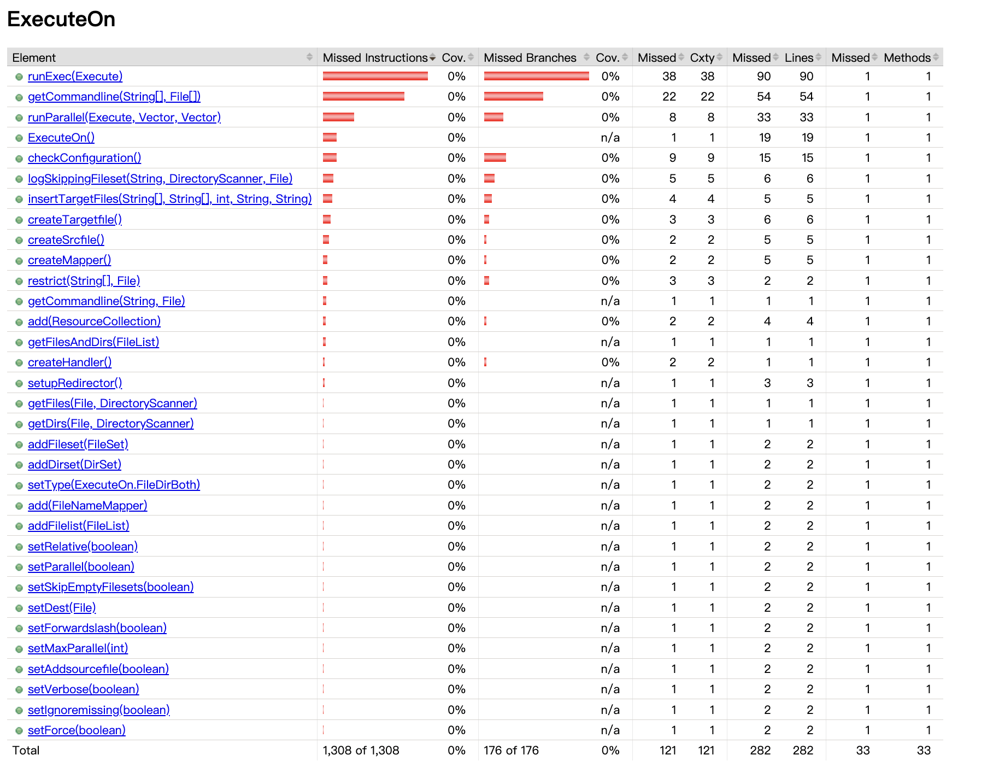

</details>

----

### 3.1 \<Delete> Coverage Test  (Author: Eleanor)
White-box testing of Delete class focusing on internal method execution, implicit logical operators, and complex integration with the [`selectors`](https://github.com/J-ihsuan/Ant-Testing-Frameworks-and-Debugging-Practices/tree/098077beda8accd6a3453f6058214c6991ad8eae/src/main/org/apache/tools/ant/types/selectors) package.

**Test File** 
  * [`DeleteWhiteBoxTest.java`](https://github.com/J-ihsuan/Ant-Testing-Frameworks-and-Debugging-Practices/blob/098077beda8accd6a3453f6058214c6991ad8eae/src/tests/junit/org/apache/tools/ant/taskdefs/DeleteWhiteBoxTest.java)


**Associated Component**
* [`removeFiles(File d, String[] f, String[] d)`](https://github.com/J-ihsuan/Ant-Testing-Frameworks-and-Debugging-Practices/blob/098077beda8accd6a3453f6058214c6991ad8eae/src/main/org/apache/tools/ant/taskdefs/Delete.java#L839-L876): Low-level file and directory array processing.
* [`setCaseSensitive(boolean)`](https://github.com/J-ihsuan/Ant-Testing-Frameworks-and-Debugging-Practices/blob/098077beda8accd6a3453f6058214c6991ad8eae/src/main/org/apache/tools/ant/taskdefs/Delete.java#L363-L366): Configuration for path-matching case sensitivity.
* [`createInclude()`](https://github.com/J-ihsuan/Ant-Testing-Frameworks-and-Debugging-Practices/blob/098077beda8accd6a3453f6058214c6991ad8eae/src/main/org/apache/tools/ant/taskdefs/Delete.java#L250-L253), [`createExclude()`](https://github.com/J-ihsuan/Ant-Testing-Frameworks-and-Debugging-Practices/blob/098077beda8accd6a3453f6058214c6991ad8eae/src/main/org/apache/tools/ant/taskdefs/Delete.java#L270-L273): Internal `PatternSet` builder methods.
* Selector Registration Methods: `addFilename()`, `addContains()`, `addNot()`, `addPresent()`, `addDepth()`, `addSize()`, `addOr()`, and `addAnd()`.

**Test Case**
| Test | Scenario | Functionality Tested | Behavioral Verification |
| :--- | :--- | :--- | :--- |
| [`testRemoveFilesDirectly()`](https://github.com/J-ihsuan/Ant-Testing-Frameworks-and-Debugging-Practices/blob/098077beda8accd6a3453f6058214c6991ad8eae/src/tests/junit/org/apache/tools/ant/taskdefs/DeleteWhiteBoxTest.java#L52-L84) | Direct Invocation of `removeFiles()` | Internal mechanism for files & directories deletion. | By bypassing the `DirectoryScanner` and injecting hardcoded string arrays (simulating scanner output), this test ensures that the `Delete` task correctly processes isolated arrays of file and directory paths, removing only what is specified and preserving adjacent files. |
| [`testDeleteByContentAndFilename()`](https://github.com/J-ihsuan/Ant-Testing-Frameworks-and-Debugging-Practices/blob/098077beda8accd6a3453f6058214c6991ad8eae/src/tests/junit/org/apache/tools/ant/taskdefs/DeleteWhiteBoxTest.java#L95-L131) | Content & Filename Deletion (Multi Selectors) | Implicit logical intersection AND when multiple selectors are added directly. | Ensures a file is deleted only if it meets **all** conditions simultaneously (e.g., content contains "ERROR" AND name matches `*.txt`). |
| [`testDeleteUsingNestedPatterns()`](https://github.com/J-ihsuan/Ant-Testing-Frameworks-and-Debugging-Practices/blob/098077beda8accd6a3453f6058214c6991ad8eae/src/tests/junit/org/apache/tools/ant/taskdefs/DeleteWhiteBoxTest.java#L140-L159) | Pattern Builder Integration (`PatternSet`) | Internal handling of standard include/exclude patterns. | Validates that `PatternSet.NameEntry` objects correctly target standard files (e.g., `*.class`) for deletion while strictly protecting excluded patterns (e.g., `*Test*`). |
| [`testCaseInsensitiveAndNotSelector()`](https://github.com/J-ihsuan/Ant-Testing-Frameworks-and-Debugging-Practices/blob/098077beda8accd6a3453f6058214c6991ad8eae/src/tests/junit/org/apache/tools/ant/taskdefs/DeleteWhiteBoxTest.java#L168-L196)| Case-Insensitive Deletion with NOT | Interaction between case-blind configuration and `NotSelector`. | Proves `caseSensitive=false` targets files regardless of casing (e.g., `.TXT` vs `.txt`), while a `NotSelector` successfully overrides this to protect specific files. |
| [`testCrossDirectoryPresenceCleanup()`](https://github.com/J-ihsuan/Ant-Testing-Frameworks-and-Debugging-Practices/blob/098077beda8accd6a3453f6058214c6991ad8eae/src/tests/junit/org/apache/tools/ant/taskdefs/DeleteWhiteBoxTest.java#L205-L237) | Cross-Directory Cleanup | Advanced filesystem state checks across different directory structures. | Uses `PresentSelector` and `IdentityMapper` to check a secondary `src` directory; ensures files in `build` directory are only deleted if their equivalent counterpart still exists in `src`. |
| [`testDeepSmallLogOrTmpCleanup()`](https://github.com/J-ihsuan/Ant-Testing-Frameworks-and-Debugging-Practices/blob/098077beda8accd6a3453f6058214c6991ad8eae/src/tests/junit/org/apache/tools/ant/taskdefs/DeleteWhiteBoxTest.java#L249-L310) | Multi-Dimensional Constraint Filtering | Aggregated selector logic combining structural, physical, and metadata conditions. |  Validates a complex, real-world maintenance scenario. It ensures a file is only deleted if it is buried in a subdirectory (Depth >= 1), falls beneath a specific file size threshold (Size < 50 bytes), and matches at least one of two file extensions (using logical OR). |

 **Test Implementation**

  The tests are executed using the project's native build script `build.sh`.
  ```
  cd ApacheAnt
  ```

  ```
  ./build.sh -Dtestcase=org.apache.tools.ant.taskdefs.DeleteWhiteBoxTest test
  ```

**Test Result**
  ```
  Testsuite: org.apache.tools.ant.taskdefs.DeleteWhiteBoxTest
  Tests run: 6, Failures: 0, Errors: 0, Skipped: 0, Time elapsed: 0.117 sec
  BUILD SUCCESSFUL
  ```
  

**Coverage Improvement Summary**  

  The new test suite yielded improvements across all core metrics. Notably, **line coverage increased by 50+ lines**, reaching 64% overall. And by testing the integration of different add configuration methods, we effectively expanded **method coverage to 59%**. These deeper execution of the task's also enhanced branch coverage to 56% and increased instruction coverage over 200, reducing unverified pathways within the filesystem manipulation logic.

  |                  | Total | Missed <br>(Before → After) | Covered <br>(Before → After) | Coverage % <br>(Before → After) | 
  |:----------------:|:-----:|:------:|:-------:|:----------:|
  | **Instructions** | 1,270 | 691 → 466 | 579 → 804 | 45% → 63% | 
  | **Branches**     | 170   | 91 → 74   | 79 → 96   | 46% → 56% | 
  | **Lines**        | 290   | 158 → 103 | 132 → 187 | 45% → 64% | 
  | **Methods**      | 49    | 32 → 20   | 17 → 29   | 35% → 59% | 

   <details>
    <summary>Click to View Detail Report of Delete After Coverage Testing</summary>
    <div align="center">
      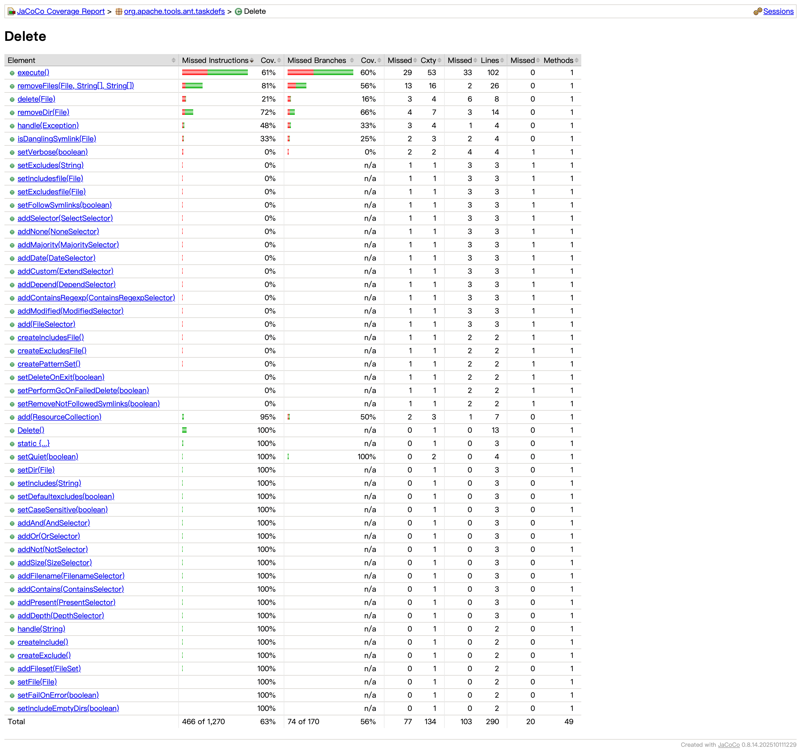
    </div>
  </details>


  ### 3.2 Coverage Improvement for \<Move> Class (Author: Chien-Tzu Yeh)
  To address the identified gaps in the `Move` class, specifically the lack of testing for error handling and the garbage collection (GC) recovery mechanism, I implemented a new test class `MoveTest.java` (specifically the `testMoveCoverageEnhancementCarol` and `testMoveFolderWithFilters` methods).

  **Test File**
  - [`MoveTest.java`](https://github.com/J-ihsuan/Ant-Testing-Frameworks-and-Debugging-Practices/blob/master/src/tests/junit/org/apache/tools/ant/taskdefs/MoveTest.java)

  **Associated Component**
  * [`renameFile`](https://github.com/J-ihsuan/Ant-Testing-Frameworks-and-Debugging-Practices/blob/afb6ab9de7ba2fac5537bec9ab1670d15b9a65de/src/main/org/apache/tools/ant/taskdefs/Move.java#L340-L358): Core logic for renaming files with fallback mechanisms.
  * [`setPerformGcOnFailedDelete`](https://github.com/J-ihsuan/Ant-Testing-Frameworks-and-Debugging-Practices/blob/afb6ab9de7ba2fac5537bec9ab1670d15b9a65de/src/main/org/apache/tools/ant/taskdefs/Move.java#L77-L97): Configuration to trigger System GC (Improved from 0% to 100% coverage).

**\<Move> Test Case**
| Test | Scenario | Functionality Tested | Behavioral Verification |
| :--- | :--- | :--- | :--- |
| [`testMoveCoverageEnhancementCarol()`](https://github.com/J-ihsuan/Ant-Testing-Frameworks-and-Debugging-Practices/blob/afb6ab9de7ba2fac5537bec9ab1670d15b9a65de/src/tests/junit/org/apache/tools/ant/taskdefs/MoveTest.java#L49-L133) | **Fault Tolerance & GC Recovery** (Compound Test) | Fallback logic (`renameFile`) & System GC triggering (`setPerformGcOnFailedDelete`). | **(1) Rename Fallback:** Utilizes a `MoveSpy` to force `renameFile` to return `false`. This verifies that the task correctly switches to the "copy-and-delete" strategy when the OS refuses a simple rename.<br>**(2) GC Logic:** Simulates a file-lock scenario during deletion. Verifies that enabling `setPerformGcOnFailedDelete(true)` correctly triggers a `System.gc()` attempt to release file handles. |
| [`testMoveFolderWithFilters()`](https://github.com/J-ihsuan/Ant-Testing-Frameworks-and-Debugging-Practices/blob/afb6ab9de7ba2fac5537bec9ab1670d15b9a65de/src/tests/junit/org/apache/tools/ant/taskdefs/MoveTest.java#L153-L174) | **Filtered Directory Move** | Integration of `FilterSet` application and directory flattening. | Configures a `Move` task with active `FilterSets` and `flatten=true`. Verifies that the task correctly processes content filtering (replacing tokens) while simultaneously restructuring the directory hierarchy (flattening) during the move operation. |

 **Test Implementation**

  The tests are executed using the project's native build script `build.sh`.
  ```
  cd ApacheAnt
  ```

  ```
  ./build.sh -Dtestcase=org.apache.tools.ant.taskdefs.MoveTest test
  ```

  **Test Result**
  ```
  Testsuite: org.apache.tools.ant.taskdefs.MoveTest
Tests run: 17, Failures: 0, Errors: 0, Skipped: 0, Time elapsed: 1.052 sec
  ```

  **Coverage Implement Summary**

  The instruction coverage increased from **66% to 71%**, and the number of missed lines decreased from **48 to 40**.

|                  | Total | Missed | Covered | Coverage % | Change (vs Original)   |
|:----------------:|:-----:|:------:|:-------:|:----------:|:----------------------:|
| **Instructions** | 905   | 261    | 644     | 71%        | +5% (+42 instructions) |
| **Branches** | 116   | 34     | 82      | 70%        | +4% (+5 branches)      |
| **Lines** | 162   | 40     | 122     | 75%        | +9% (+8 lines)         |
| **Methods** | 11    | 0      | 11      | 100%       | +10% (+1 method)       |


  <details>
  <summary>Click to View Detail Reports of Move</summary>

  - **Overall Coverage**
  
  - **Detail Coverage**
  
  </details>

----
**Implemented Tests and Functionality Analysis**

The new test cases were designed to target the "red areas" identified in the initial report by simulating failure scenarios that are difficult to trigger during normal execution.
  - **Simulating System Failures with `MoveSpy`**
    - **Technique Used**: I created an inner class `MoveSpy` that extends `Move` and overrides the renameFile method to always return false.

    - **Purpose**: The original `Move` task attempts to rename a file first; if that fails (e.g., due to OS locks), it falls back to a "copy and delete" strategy. Standard tests always succeeded at renaming, leaving the fallback logic untested. `MoveSpy` forces the system to execute this fallback logic.

  - **Verifying Garbage Collection (GC) Logic** (`setPerformGcOnFailedDelete`)
    - **Test Logic**: In `testMoveCoverageEnhancementCarol`, I explicitly enabled this flag (`failSpy.setPerformGcOnFailedDelete(true)`).

    - **Outcome**: This successfully covered the logic that attempts to request a System GC when a file deletion fails, ensuring the task tries to release file locks before retrying. As shown in the detailed report, `setPerformGcOnFailedDelete` reached **100%** coverage.

  - **Testing Filtered Moves (`testMoveFolderWithFilters`)**
    - **Targeted Code**: Logic related to filtering and flattening during directory moves.

    - **Test Logic**: I introduced a test case that sets setFiltering(true) and setFlatten(true) while moving a fileset.

    - **Outcome**: This exercised the branches responsible for handling file content filtering and directory structure flattening, contributing to the increase in instruction and branch coverage.


### 3.3 Coverage Improvement for <Copy> Class (Author: Chien-Tzu Yeh)
To improve the coverage of the `Copy` class, I focused on "unreachable" private methods and complex attribute validations that were missed by the original test suite. I implemented `CarolBoostTest.java` to target these specific areas.

**Test File**
* [`Copy.java`](https://github.com/J-ihsuan/Ant-Testing-Frameworks-and-Debugging-Practices/blob/master/src/main/org/apache/tools/ant/taskdefs/Copy.java)

 **Associated Component**
  * [`getDueTo(Exception)`](https://github.com/J-ihsuan/Ant-Testing-Frameworks-and-Debugging-Practices/blob/afb6ab9de7ba2fac5537bec9ab1670d15b9a65de/src/main/org/apache/tools/ant/taskdefs/Copy.java#L1074-L1093): Private method for generating error messages (Tested via Reflection).
  * [`validateAttributes()`](https://github.com/J-ihsuan/Ant-Testing-Frameworks-and-Debugging-Practices/blob/afb6ab9de7ba2fac5537bec9ab1670d15b9a65de/src/main/org/apache/tools/ant/taskdefs/Copy.java#L676-L726): Task attribute validation logic.

  **\<Copy> Test Case**
  | Test | Scenario | Functionality Tested | Behavioral Verification |
| :--- | :--- | :--- | :--- |
| [`testCopyCoverageBoost()`](https://github.com/J-ihsuan/Ant-Testing-Frameworks-and-Debugging-Practices/blob/afb6ab9de7ba2fac5537bec9ab1670d15b9a65de/src/tests/junit/org/apache/tools/ant/taskdefs/CarolBoostTest.java#L11-L45) | **Private Error Handling** (Reflection) | Internal exception message generation logic (`getDueTo`). | By utilizing **Java Reflection** to bypass access controls, this test directly invokes the private `getDueTo` method. It ensures that the task generates the precise, expected exception messages for obscure failure conditions that are unreachable via standard API calls. |
| [`testCopyComplexResourceMapping()`](https://github.com/J-ihsuan/Ant-Testing-Frameworks-and-Debugging-Practices/blob/afb6ab9de7ba2fac5537bec9ab1670d15b9a65de/src/tests/junit/org/apache/tools/ant/taskdefs/CarolBoostTest.java#L47-L66) | **Edge Case Resource Validation** | Robustness of `validateAttributes` and `buildMap`. | Injects complex `FileResource` arrays and non-existent source files into the task. This verifies that the task's validation logic correctly identifies invalid inputs and handles resource loops gracefully without throwing unexpected runtime exceptions. |

 **Test Implementation**

  The tests are executed using the project's native build script `build.sh`.
  ```
  cd ApacheAnt
  ```

  ```
  ./build.sh -Dtestcase=org.apache.tools.ant.taskdefs.CarolBoostTest test
  ```

  **Test Result**
  ```
  Tests run: 2, Failures: 0, Errors: 0, Skipped: 0, Time elapsed: 0.081 sec
BUILD SUCCESSFUL
  ```

**Coverage Implement Summary**

The instruction coverage increased from **75% to 78%**, and the number of missed lines decreased from **92 to 72**, recovering **20 lines** of previously untested code.

|                  | Total | Missed | Covered | Coverage % | Change (vs Original)   |
|:----------------:|:-----:|:------:|:-------:|:----------:|:----------------------:|
| **Instructions** | 1,917 | 407    | 1,510   | 78%        | +3% (+63 instructions) |
| **Branches** | 254   | 84     | 170     | 66%        | +2% (+5 branches)      |
| **Lines** | 409   | 72     | 337     | 82%        | +5% (+20 lines)        |
| **Methods** | 52    | 1      | 51      | 98%        | +12% (+6 methods)      |

<details>
<summary>Click to View Detail Report of Copy</summary>

- **Overall Coverage**


- **Detail Coverage**
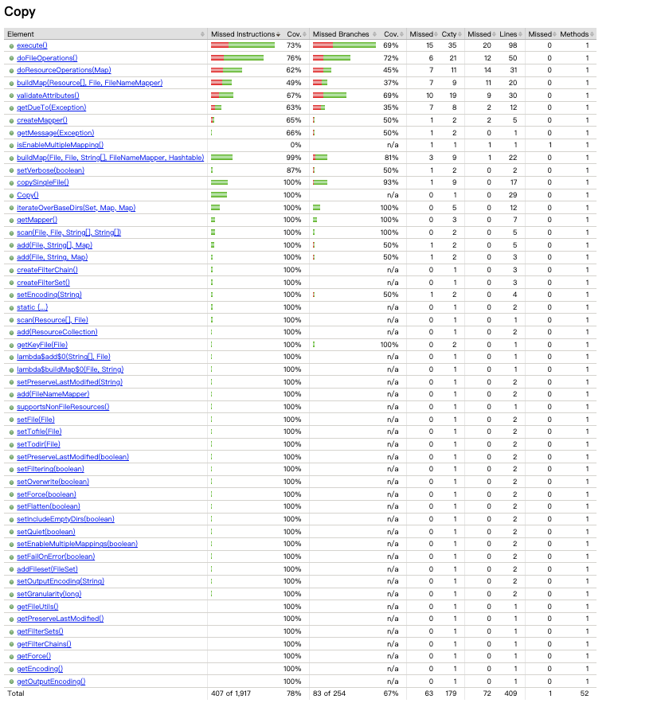

</details>

----

**Implemented Tests and Functionality Analysis**
The new test cases utilized Java Reflection and complex resource simulations to bypass standard API restrictions and trigger internal error handling logic.

- **Testing Private Methods via Reflection (`testCopyCoverageBoost`)**

    - **Technique Used**: I utilized Java Reflection (`Method.setAccessible(true)`) to invoke the private method `getDueTo(Exception)` directly with a test exception.

    - **Purpose**: This private method was unreachable via standard API calls during normal execution. Reflection allowed me to verify that the error message generation logic is correct without needing to force a complex hardware failure.

    - **Outcome**: This technique proved effective, raising the method's coverage from **0% to 63%**.

- **Verifying Complex Resource Mapping (`testCopyComplexResourceMapping`)**
    - **Targeted Code**: The `buildMap` method and `validateAttributes` logic.

    - **Test Logic**: I simulated specific edge cases, such as providing non-existent source files and complex `FileResource` arrays, to trigger validation failures and specific resource loop paths.

    - **Outcome**: This exercised the branches responsible for handling invalid inputs and processing resource arrays, successfully increasing the branch coverage in the resource handling logic.


### 3.4 Coverage Improvement for \<ExecuteOn> Class (Author: Chien-Tzu Yeh)
To address the total absence of testing in the ExecuteOn class, I implemented CarolExecuteOnTest.java to establish a baseline functional test, focusing on core attribute configuration and the execution lifecycle.

**Test File** 
* [`CarolExecuteOnTest.java`](https://github.com/J-ihsuan/Ant-Testing-Frameworks-and-Debugging-Practices/blob/master/src/main/org/apache/tools/ant/taskdefs/ExecuteOn.java)

 **Associated Component**
  * [`ExecuteOn`](https://github.com/J-ihsuan/Ant-Testing-Frameworks-and-Debugging-Practices/blob/afb6ab9de7ba2fac5537bec9ab1670d15b9a65de/src/main/org/apache/tools/ant/taskdefs/ExecuteOn.java#L55-L89): The entire class logic, which previously had 0% coverage.
  * [`createTargetfile()`](https://github.com/J-ihsuan/Ant-Testing-Frameworks-and-Debugging-Practices/blob/afb6ab9de7ba2fac5537bec9ab1670d15b9a65de/src/main/org/apache/tools/ant/taskdefs/ExecuteOn.java#L266-L274): Logic for constructing command line target files.

    **\<ExecuteOn> Test Case**


| Test | Scenario | Functionality Tested | Behavioral Verification |
| :--- | :--- | :--- | :--- |
| [`testExecuteOnCoverageBoost()`](https://github.com/J-ihsuan/Ant-Testing-Frameworks-and-Debugging-Practices/blob/afb6ab9de7ba2fac5537bec9ab1670d15b9a65de/src/tests/junit/org/apache/tools/ant/taskdefs/CarolExecuteOnTest.java#L8-L35) | **Task Configuration & Execution** (Smoke Test) | Setter validation, Command Line construction, and `execute()` lifecycle. | Acts as a functional baseline for the previously untested class. It configures the task with a comprehensive set of attributes (e.g., `verbose`, `parallel`, `skipEmpty`) and executes a system command (`echo`). This verifies that `ExecuteOn` correctly integrates with the underlying `ExecTask`, successfully constructing the command line and entering the execution loop. |

 **Test Implementation**

  The tests are executed using the project's native build script `build.sh`.
  ```
  cd ApacheAnt
  ```

  ```
  ./build.sh -Dtestcase=org.apache.tools.ant.taskdefs.CarolExecuteOnTest test
  ```

**Test Result**
```
Testsuite: org.apache.tools.ant.taskdefs.CarolExecuteOnTest
Tests run: 1, Failures: 0, Errors: 0, Skipped: 0, Time elapsed: 0.079 sec
BUILD SUCCESSFUL
```

**Coverage Implement Summary**

The new tests successfully initialized the class and executed its core logic, reducing missed lines from **282 to 237**. This single test class contributed a massive **45 lines** of code coverage improvement.

<details>
<summary>Click to View Detail Report of ExecuteOn</summary>

- **Overall Coverage**


- **Detail Coverage**
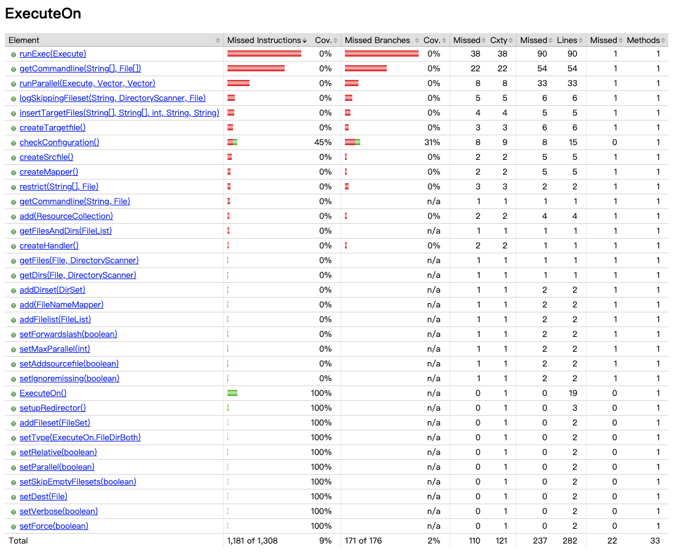

</details>

----

**Implemented Tests and Functionality Analysis**

The new test class `CarolExecuteOnTest` was designed to be a functional verification test to ensure the task can be correctly configured and executed.

- **Validating Command Execution Logic (`testExecuteOnCoverageBoost`)**

    - **Technique Used**: I created a test that configures the task to run the system echo command and extensively exercises the Setter methods.

    - **Purpose**: To verify that the ExecuteOn task can correctly parse attributes, build the command line, and attempt execution without crashing. This fills the void of having zero prior tests for this class.

    - **Test Logic**: I invoked multiple setters (e.g., setVerbose, setParallel, setSkipEmptyFilesets) to cover configuration logic, and then triggered execute() by adding a valid FileSet (using the test file itself as input) to force the task into its main execution loop.

    - **Outcome**: This validated the integration between ExecuteOn and the underlying ExecTask, successfully bringing the class from a completely untested state (0%) to having its core execution path and parameter validation logic verified.

</details>

<details>
  <summary><H1> Part 4. Continuous Integration. </H1></summary>
  
  ## 1. What is Continuous Integration (CI) and its Purpose?
  **Continuous Integration (CI)** is a software development practice where team members frequently integrate their work into a shared repository.
  - **Purpose**: To detect integration errors as early as possible (Fail Fast).
  - **Automation**: It replaces manual testing by automatically building and testing the system whenever code changes are pushed.
  - **Reliability**: Ensures the master branch remains stable and deployable at all times.

  ## 2. CI System Configuration
  We selected **GitHub Actions** as our cloud-based CI system for this project.

  ### 2.1 Why GitHub Actions?
  - **Seamless Integration**: Since our project is already hosted on GitHub, Actions is built-in and **requires no third-party account setup**.
  - **Workflow Transparency**: It allows us to see the build status (Success/Failure) directly within Pull Requests.
  - **Pre-configured Environments**: It provides clean, managed virtual machines, which solved our local environment dependency issues.

  ### 2.2 Configuration Details:
  - **Workflow File**: Defined in .github/workflows/ci.yml.
  - **Runner Environment**: ubuntu-latest virtual machine.
  - **Java Version**: JDK 17 (Temurin distribution).
  - **Build Command**: ant junit-tests. This command automatically triggers all unit tests defined in the project's build.xml.

  ## 3. Issues Encountered & Solutions
  During the implementation, we encountered several technical challenges that highlight the value of a robust CI environment:

  - **Local Environment Dependencies**: When attempting to install Apache Ant on macOS via Homebrew, the system required a full installation of **Xcode (over 12GB)**. We decided to bypass this by leveraging GitHub Actions' pre-installed Ant environment, saving time and storage.
  - **Missing Test Suites**: Running the default `ant test` locally failed due to a missing `AntUnit` library dependency. After analyzing the `build.xml` and logs, we adjusted the command to `ant junit-tests`. This allowed us to successfully run the core JUnit test cases without the optional AntUnit extension.

  ## 4. Verification & Results
  ### 4.1 Local Verification

  Before pushing to CI, we verified the test suite locally using the `ant junit-tests` command to ensure the code logic was sound.
  ```
  Status: Local Build Successful. JUnit Report generated with 100% pass rate.
  ```
  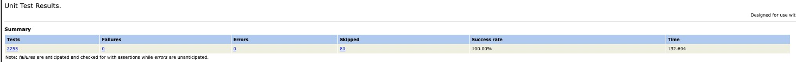

  ### 4.2 CI Verification (GitHub Actions)
  
  As shown in the screenshots below, GitHub Actions automatically triggers a build whenever code is merged into `master`.

  - **Job Name**: build-and-test (Defined in our YAML to handle environment setup and test execution).
  - **Result**: Both the Pull Request checks and the final merge to `master` show a **green checkmark (Success)**, proving the system builds correctly and all test cases passed in a clean cloud environment.

  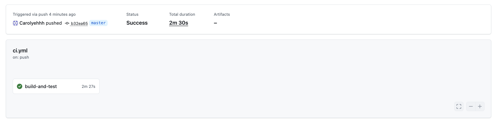 
  

</detail>